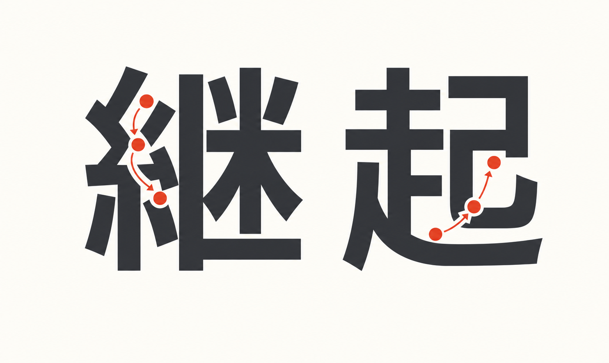

# keiki — 継起

<p align="center">
  
</p>

A Haskell library for the **pure core** of event sourcing, workflow
engines, and durable execution, built on one formalism: the
symbolic-register finite-state transducer.

keiki keeps the runtime boundary deliberately small. You describe an
aggregate or workflow once as a typed transducer; the library provides
forward decisions, replay, acceptors, projections, composition machinery,
diagram renderers, and optional symbolic checks from that single
declaration.

## The name

**継起** (*keiki*) is the Japanese word for **"successive occurrence"** —
events that follow, one after another, each rising out of what came before.

| Kanji | Reading | Meaning |
|---|---|---|
| 継 | *kei* | to continue, to succeed (as an heir does), to follow on |
| 起 | *ki*  | to rise, to occur, to begin, to happen |

The choice is literal. An event-sourced aggregate is a sequence of events
in succession, each one rising out of the state the previous events left
behind. *keiki* names that pattern directly: 継 (the prior event is
succeeded by) 起 (the next one rising). The replay fold —
`reconstitute :: [Event] → State` — is exactly the operation the word
describes.

(Disambiguation, since the romanisation is ambiguous: this is 継起, not
景気 *keiki* "economic conditions" nor 計器 *keiki* "gauge / instrument".
Only the 継起 reading carries the "succession of events" sense.)

## What it is

A unified treatment of three problems often solved with separate
runtime concepts:

1. **Event sourcing** — store the immutable log of events, replay to
   recover state.
2. **Workflow engines** — coordinate long-running multi-step processes.
3. **Durable execution** — resume cleanly after a crash, mid-process.

keiki models all three as **finite-state transducers** with a typed
register file and predicate-labelled guards: a practical hybrid of
Symbolic Finite Transducers and Streaming String Transducers. From one
`SymTransducer` declaration, the library provides:

- strict forward-decision and replay operations with structured failure diagnostics
  (`stepEither`, `reconstituteEither`, and `replayEvents`),
- input- and output-side `Acceptor`s,
- per-vertex projections (the "B-presentation" view),
- checked sequential composition (`composeChecked`) plus `alternative` and `feedback1`,
- profunctor / `Category` / `Strong` / `Choice` / `Arrow` instances,
- Mermaid and Markdown renderers for documentation,
- eager builder validation, default-on replay-safety checks, and optional
  single-valuedness checks via SBV + z3.

`delta` / `omega` / `applyEvent` use concrete predicate evaluation — no
solver in the per-event hot path. Solver dispatch is reserved for
build-time analysis.

## Status

Pre-1.0, prepared for the initial `0.1.0.0` Hackage release. The
planned v0.1 surface is implemented and validated against in-tree tests
plus the downstream `jitsurei` worked-example package.

The core package is intentionally codec-free. JSON support lives in
[`keiki-codec-json`](keiki-codec-json/README.md), and downstream codec
testing helpers live in
[`keiki-codec-json-test`](keiki-codec-json-test/README.md). The JSON event
codec supports pinned wire kinds, in-band schema versions, and explicit
upcaster chains for persisted-event evolution.

## Build

Requires GHC 9.12 and (for the symbolic analyses only) `z3` on `PATH`.

```sh
nix develop          # provides ghc 9.12, cabal, z3
cabal build all
cabal test all
```

Pure evaluation (`delta`, `omega`, `step`, `reconstitute`) does not
depend on z3. The symbolic checks in `Keiki.Symbolic` will fail loudly
if z3 is missing when invoked.

## A taste

The smallest useful aggregate, in full:

```haskell
emailDelivery
  :: SymTransducer (HsPred EmailRegs EmailCmd)
                   EmailRegs EmailVertex EmailCmd EmailEvent
emailDelivery = B.buildTransducer EmailPending emptyRegFile
                  (\case EmailSentVertex -> True; _ -> False) do
  B.from EmailPending do
    B.onCmd inCtorSendEmail $ \d -> B.do
      B.slot @"emailRecipient" .= d.recipient
      B.slot @"emailSubject"   .= d.subject
      B.slot @"emailSentAt"    .= d.at
      B.emit wireEmailSent EmailSentTermFields
        { recipient = d.recipient
        , subject   = d.subject
        , at        = d.at
        }
      B.goto EmailSentVertex
```

Forward decisions, structured replay, `Acceptor`s, and the per-vertex
view all operate from this one declaration. See the downstream
`jitsurei` package for the full worked aggregates the test suite drives.

## Repository documentation

The repository includes user guides, design notes, and implementation
history:

| Folder | Audience |
|---|---|
| `docs/foundations/` | Onboarding. Reads as a tutorial in ~1 hour; assumes Haskell, no automata-theory background. Start at `00-reading-guide.md`. |
| `docs/guide/` | Action-oriented. `user-guide.md` is the canonical authoring walkthrough; topical guides cover composition, profunctors, symbolic CI, AST drop-down, and B-views. |
| `docs/research/` | Design notes for the library itself. Assume foundations vocabulary. The current baseline is `synthesis-c-foundation-b-presentation-with-worked-examples.md`. |
| `docs/adr/` | Stable architecture decisions distilled from the plan history. |
| `docs/plans/` and `docs/masterplans/` | Execution records for the work that produced v0.1. |
| `docs/historical/` | Superseded design notes, retained for context only. |

For a status snapshot — what's implemented, what's next, and what's intentionally
out of scope — see [`ROADMAP.md`](ROADMAP.md).

Recommended shortest path:

1. `docs/foundations/00-reading-guide.md` — orientation.
2. `docs/guide/user-guide.md` — write your first aggregate.
3. `docs/research/synthesis-c-foundation-b-presentation-with-worked-examples.md` — the design baseline.

## License

BSD-3-Clause. See [`keiki.cabal`](keiki.cabal) for package metadata.
