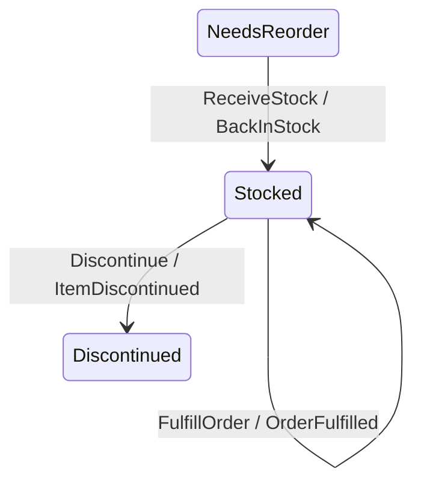
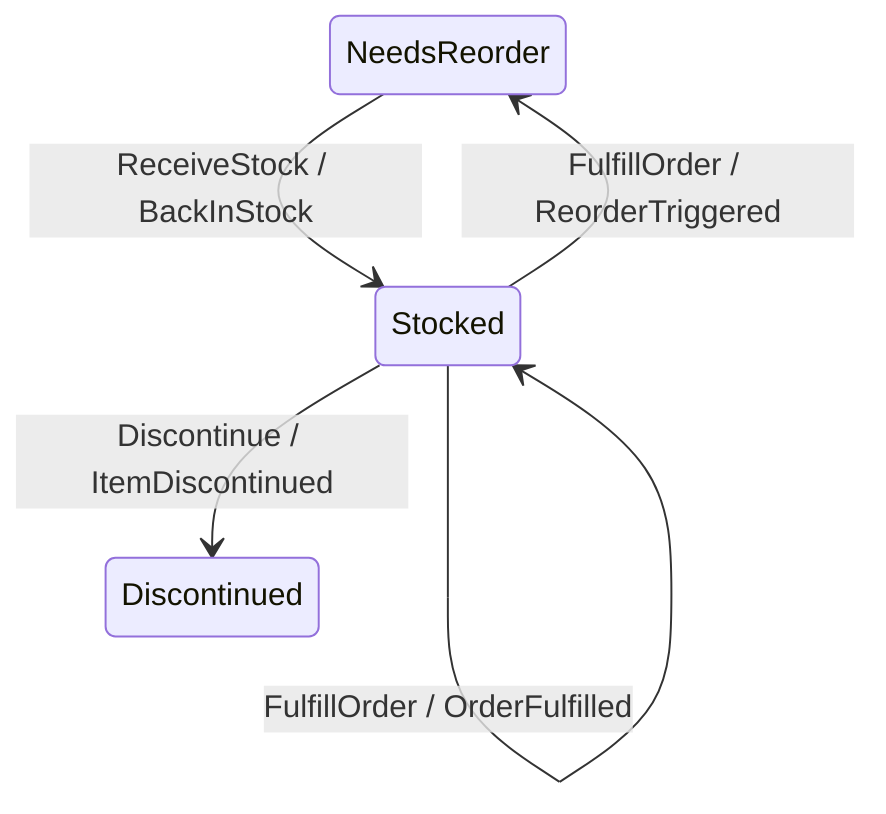

# Deriving lifecycle transitions

How to model a status/lifecycle vertex transition that is *derived* from a
threshold over tally registers — and, more importantly, **where to put the
re-evaluation** so the transition cannot silently fail to fire.

This is the modeling companion to `docs/guide/modeling-collections.md`
(turning a collection into scalar tallies) and `docs/guide/why-smt.md` (what
the single-valuedness gate does and does not prove). Read those first if the
vocabulary here is unfamiliar.

---

## 1. The pattern, and the bug it prevents

A common shape: an aggregate accumulates a quantity in a register, and a
*status* should flip when that quantity crosses a threshold — in **both**
directions. A rewards balance crosses into "preferred"; an account crosses
into "overdrawn"; a warehouse SKU crosses below its reorder point. The
quantity goes up via one set of commands and down via another.

The trap is asymmetry. The "up" path is the one you think about first — it's
the happy path, the one with the celebratory event — so you wire the promote
check to it and ship. The "down" path is wired later, or by a different
person, or never. The status then has a one-way door: it can be entered but
not left. Nothing throws. The aggregate just quietly reports a status that
its own registers contradict, and the discrepancy surfaces months later as
"why is this still marked active?"

This door is invisible in scattered handler code. It is **glaring** as a
topology. Rendered (`Keiki.Render.Mermaid`, which labels edges
`Command / Event` and deliberately omits the guard), the bug looks like this
— `Stocked` has no edge back to `NeedsReorder`:



and the fix is one missing arrow — a second `FulfillOrder` edge out of
`Stocked`, distinguished from the self-loop only by a guard the diagram does
not show:



This guide is about how to author that second arrow so the act of crossing
the threshold *is* the transition — not a separate step something else has to
remember to trigger.

---

## 2. The running example

A warehouse stock item. One tally (`onHand`), one threshold
(`reorderPoint`), a status that must flip both ways, and a terminal end.

```haskell
data Vertex = NeedsReorder | Stocked | Discontinued
  deriving stock (Eq, Show, Enum, Bounded)
-- initial = NeedsReorder ; isFinal Discontinued = True ; isFinal _ = False

type StockRegs =
  '[ '("onHand",       Int)   -- units physically present
   , '("reorderPoint", Int)   -- threshold; seeded at onboarding (see §6)
   ]
```

`onHand` rises on `ReceiveStock` and falls on `FulfillOrder`. The lifecycle
fact is the *vertex*: `NeedsReorder` ⇄ `Stocked`. We use `Int` so the guard
is solver-visible (any curated type works — `Int`, `Integer`, the
fixed-width ints, `UTCTime`, `Text`, `Bool`; see `why-smt.md` §5).

The three sections that follow are three ways to wire the flip. They are
ordered worst to best for this shape.

---

## 3. Option 1 — a separate re-check command (the trap)

The tempting decomposition: keep the mutating commands as pure tally
self-loops, and introduce a `CheckStockLevel` command that does the flip.
A router/subscription dispatches it after each mutation.

```haskell
B.from Stocked do
  B.onCmd inCtorFulfillOrder $ \d -> B.do        -- self-loop: just decrement
    B.slot @"onHand" .= #onHand .- d.quantity
    B.emit wireOrderFulfilled OrderFulfilledTermFields { quantity = d.quantity, at = d.at }
    B.goto Stocked

  B.onCmd inCtorCheckStockLevel $ \d -> B.do     -- the demote, fired by... whom?
    B.requireGuard (pnot (#onHand .>= #reorderPoint))
    B.emit wireReorderTriggered ReorderTriggeredTermFields { onHand = #onHand, at = d.at }
    B.goto NeedsReorder
```

The `ReorderTriggered` edge now *exists* and is correct. But whether it ever
fires depends on the router dispatching `CheckStockLevel` after a
`FulfillOrder`. That dispatch lives in the runtime/effects layer, **outside
everything keiki verifies** (`docs/research/effects-boundary.md`). If the
router checks after `ReceiveStock` but not after `FulfillOrder` — the exact
asymmetry of §1 — you have reintroduced the one-way door, and:

- `isSingleValuedSym` is **green**. The edges are disjoint by input
  constructor; an un-dispatched command is not a transducer defect.
- A reachability query says `NeedsReorder` *is* reachable from `Stocked` —
  the edge is there. Reachability of an edge is not the same as it firing.

So this option moves the failure out of sight rather than removing it. It is
the right factoring only when the re-check is genuinely externally driven
(a nightly sweep, an operator action) and you accept that the trigger is
unverified. If the re-check should happen *because of* the mutation, prefer
§4 or §5.

---

## 4. Option 2 — split the mutating edge (atomic, boundary-verified)

Make the threshold crossing part of the command that changes the tally. From
`Stocked`, a `FulfillOrder` becomes **two** edges keyed on the same input
constructor, disambiguated by the *prospective* post-decrement value:

```haskell
B.from Stocked do
  -- Decrement that stays at/above the reorder point: remain Stocked.
  B.onCmd inCtorFulfillOrder $ \d -> B.do
    B.requireGuard ((#onHand .- d.quantity) .>= #reorderPoint)
    B.slot @"onHand" .= #onHand .- d.quantity
    B.emit wireOrderFulfilled OrderFulfilledTermFields { quantity = d.quantity, at = d.at }
    B.goto Stocked

  -- Decrement that crosses below: demote. The arrow you must not omit.
  B.onCmd inCtorFulfillOrder $ \d -> B.do
    B.requireGuard ((#onHand .- d.quantity) .< #reorderPoint)
    B.slot @"onHand" .= #onHand .- d.quantity
    B.emit wireReorderTriggered ReorderTriggeredTermFields
      { onHand = #onHand .- d.quantity, at = d.at }
    B.goto NeedsReorder
```

The prospective value is a structural arithmetic term (`#onHand .- d.quantity`,
i.e. `tsub`; see EP-43 and user-guide §3.4), so the whole guard is visible to
the solver. The promote direction is the mirror image from `NeedsReorder` on
`ReceiveStock`.

> **On invertibility and the diagram.** This split-into-disjoint-edges shape is
> also the structural answer to a multi-way decision: author one guarded edge per
> branch, never an opaque function that picks a branch
> (`docs/guide/output-invertibility.md` §8b). Note one subtlety in the demote edge:
> the *same* term `#onHand .- d.quantity` is fine in the **guard** (it replays
> forward via `evalTerm` and the solver reads it) but appears again in
> `ReorderTriggered`'s **output** payload (`onHand = #onHand .- d.quantity`) — and
> structural arithmetic *in an output* is not invertible, so that event does **not**
> round-trip on replay today. See the output-invertibility contract
> (`docs/guide/output-invertibility.md`); the portable workaround is a mirror
> command, which the sibling plan
> `docs/plans/47-recompute-and-verify-derived-event-outputs-in-solveoutput-replay.md`
> removes the need for. Separately, the Mermaid default edge label is deliberately
> guard-free (as noted near the top of this guide); the renderer's opt-in
> structural summary ([Mermaid rendering](mermaid-rendering.md)) keeps that default
> guard-free — the diagram is not going to start showing the guards that
> distinguish these two edges unless you ask for the summary explicitly.

Here the single-valuedness gate does **real** work. The two `FulfillOrder`
edges share an input constructor, so the gate must prove their guards never
co-fire:

```
g_stay = (onHand - quantity) >= reorderPoint
g_drop = (onHand - quantity) <  reorderPoint
```

When you author them as two independent comparisons like this, z3 proves
`g_stay ∧ g_drop` unsatisfiable — which is precisely where it catches the
boundary mistake (`>=` vs `>`, `<` vs `<=`) that no property test reliably
hits (`why-smt.md` §1). This relies on the translator sharing one solver
variable across the repeated reads of `onHand`, `reorderPoint`, and
`quantity` — delivered by per-slot memoization (EP-42); without it the gate
would spuriously fail.

> Authoring tip: write the two guards as independent comparisons, not as `g`
> and `pnot g`. The literal-negation form is correct by construction and the
> gate passes trivially — you lose the boundary check that is the whole point
> of putting it under the solver.

What this costs: the split repeats on **every** tally-decreasing command. One
decrement verb is two edges; four decrement verbs are eight. When the
decreasing alphabet is wide, the duplication is real — which motivates §5.

What it does **not** prove: that one of the two edges always fires
(completeness). For a clean partition (`>=` / `<`) totality holds by
construction, but keiki does not check it — see §7.

---

## 5. Option 3 — re-check via `feedback1` (atomic and DRY)

Keep the single, DRY threshold edge of Option 1, but fire it *inside* the
transducer instead of from the router. The mutating command stays a plain
self-loop; a stateless policy reacts to its event by issuing a synthetic
`Recheck`, and `feedback1` composes the two so the whole thing is **one
observed step** (`composition.md` §9; the `toggle`/`echoPolicy` cascade in
§9.4 is the worked shape).

```haskell
B.from Stocked do
  B.onCmd inCtorFulfillOrder $ \d -> B.do        -- self-loop: decrement + emit
    B.slot @"onHand" .= #onHand .- d.quantity
    B.emit wireOrderFulfilled OrderFulfilledTermFields { quantity = d.quantity, at = d.at }
    B.goto Stocked

  B.onCmd inCtorRecheck $ \_ -> B.do             -- single demote edge
    B.requireGuard (#onHand .< #reorderPoint)
    B.emit wireReorderTriggered ReorderTriggeredTermFields { onHand = #onHand, at = recheckAt }
    B.goto NeedsReorder

B.from NeedsReorder do
  B.onCmd inCtorReceiveStock $ \d -> B.do        -- self-loop: increment + emit
    B.slot @"onHand" .= #onHand .+ d.quantity
    B.emit wireStockReceived StockReceivedTermFields { quantity = d.quantity, at = d.at }
    B.goto NeedsReorder

  B.onCmd inCtorRecheck $ \_ -> B.do             -- single promote edge
    B.requireGuard (#onHand .>= #reorderPoint)
    B.emit wireBackInStock BackInStockTermFields { onHand = #onHand, at = recheckAt }
    B.goto Stocked
```

The policy fed to `feedback1` maps each mutation event (`StockReceived`,
`OrderFulfilled`) to a `Recheck` command. Because the cascade is one round,
there is no external trigger to forget: emitting the mutation event *is* what
schedules the flip. Add a decrement verb later and it routes through the same
`Recheck` automatically.

Two wrinkles to plan for:

- **The re-check needs no payload but may need a clock.** `Recheck` carrying
  no fields means its guard reads `onHand`/`reorderPoint` straight from the
  registers (good — see §6), but it also has no `at`. Source the timestamp
  from a sentinel — exactly what `LoanApplication` does for its payload-free
  `Continue` (`loan-application-tutorial.md` §7) — or give `Recheck` a
  one-field payload to carry it.
- **The boundary is not cross-checked.** The promote guard
  (`onHand >= reorderPoint`, on `NeedsReorder`) and the demote guard
  (`onHand < reorderPoint`, on `Stocked`) live in *different* vertices.
  Single-valuedness is per-vertex and pairwise, so it never compares them —
  nothing mechanical guarantees they are exact complements. If boundary
  verification matters more than DRY-ness, use Option 2; if DRY-ness matters
  more and you'll cover the boundary with a focused test, use Option 3.

---

## 6. Threshold as a register vs. on the command

The flip guard has to read the threshold. Two homes:

- **As a register** (`reorderPoint` above), seeded by an onboarding command
  and updated by a re-configuration command. The guard reads it with the
  tally; a payload-free `Recheck`/`Continue` works (§5). Best when the
  threshold belongs to *this* stream and changes rarely.
- **On the re-check command** (`Recheck { reorderPoint, at }`). Best when the
  threshold is owned elsewhere (a policy table, a parent config) and the
  dispatcher should inject the current value at decision time. This is what
  the production decomposition in
  `docs/research/agent-qualification-decomposition-sketch.md` does
  (`QualifyCheck`/`RequalifyCheck` carry `minVolume`/`minSides`).

Either keeps the guard solver-visible as long as the comparison is a
structural `PCmp` over curated types. A *derived* threshold (a cap computed
from another register) is also fine when written with structural arithmetic
(`tadd`/`tsub`/`tmul`, i.e. `.+`/`.-`/`.*`); only genuinely opaque Haskell or
fractional (`Double`/SReal) arithmetic falls back to a `TApp` escape and
loses precision (`why-smt.md` §5).

---

## 7. What each option gives you

| | Trigger lives in | Single-valuedness gate | Boundary (`<`/`≤`) checked | Edge count |
|---|---|---|---|---|
| **Option 1** — external re-check | runtime/router (**unverified**) | green but vacuous | no | low |
| **Option 2** — split mutating edge | the transducer (**verified**) | does real work | **yes**, with independent guards | high (× decrement verbs) |
| **Option 3** — `feedback1` re-check | the transducer (**verified**) | input-ctor disjoint only | no (guards in different vertices) | low |

The property keiki verifies is always *single-valuedness of the transducer* —
never that a command gets dispatched, and never *completeness* (that some edge
always fires). The structural win of Options 2 and 3 over Option 1 is
therefore not what the solver proves; it is that the threshold crossing
becomes a transition **inside** the verified core, with no external trigger to
omit. Option 2 adds a solver-checked boundary on top of that.

Reachability — "is `NeedsReorder` reachable from `Stocked`?" — is a finite
walk over `edgesOut`, no solver needed. Asserting it in a test is a cheap
guard against the one-way-door bug: it fails the moment the demote edge is
deleted. It does not, however, prove the edge ever fires at runtime (that is
the Option 1 caveat).

---

## 8. When not to reach for this

- **The status change is genuinely externally driven** — a periodic sweep, an
  operator decision, an upstream signal — not caused by a tally mutation.
  Then Option 1 is honest: model the re-check as its own command and accept
  that its trigger is a runtime concern.
- **The threshold is fractional and must stay exact** (a `0.5` weight). The
  guard goes opaque (`TApp`) and the solver bonus of Option 2 evaporates;
  prefer a doubled-integer reformulation if you want to keep it, or accept a
  property test. See `agent-qualification-decomposition-sketch.md` §3.
- **The lifecycle is one-way by design** (a loan, once approved, is never
  un-approved). Then a terminal vertex with no exit is *correct*, not a bug —
  the absence of a return edge is intentional. This guide is about the cases
  where the status is meant to be revocable.

---

## 9. Pointers

- `docs/guide/modeling-collections.md` — §5 (set-wide invariants, atomic
  "is the next one allowed?") and the tally pattern this builds on.
- `docs/guide/why-smt.md` — what single-valuedness proves; the boundary bug
  Option 2 catches.
- `docs/guide/symbolic-ci.md` — wiring the gate into CI.
- `docs/guide/composition.md` §9 — `feedback1`, the one-round cascade behind
  Option 3 (worked `toggle`/`echoPolicy` example in §9.4).
- `docs/guide/loan-application-tutorial.md` §7 — the synthetic `Continue`
  command and its sentinel-sourced clock (the §5 wrinkle). Note its
  `Continue` is driven by an external runtime tick — the Option 1 shape, not
  the Option 3 `feedback1` cascade.
- `docs/research/agent-qualification-decomposition-sketch.md` — the
  production aggregate that motivated this guide; it uses the Option 1 shape
  (`RequalifyCheck`) and is the real-world case where the omitted trigger bit.
