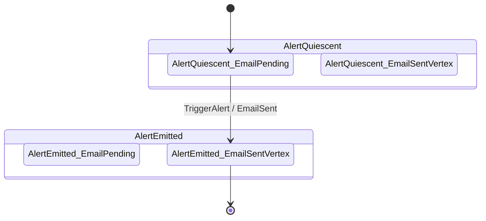

# AlertSource ⨾ EmailDelivery composite topology (nested form)

Rendered by `Keiki.Render.Mermaid.toMermaidCompositeNested` over the
`pipeline` value (`compose alertSource emailDelivery`) defined in
`test/Keiki/CompositionSpec.hs`. The pipeline lives in a test module
rather than the library, so refreshing this diagram requires loading
that module into ghci. To refresh:

    cabal repl keiki-test --repl-no-load
    ghci> :load Keiki.CompositionSpec
    ghci> import Keiki.Render.Mermaid (toMermaidCompositeNested)
    ghci> import qualified Data.Text.IO as TIO
    ghci> TIO.putStrLn (toMermaidCompositeNested Keiki.CompositionSpec.pipeline)

The composite has 4 vertices in total — the cross-product of
`AlertVertex` (`AlertQuiescent`, `AlertEmitted`) and `EmailVertex`
(`EmailPending`, `EmailSentVertex`). The nested form groups all four
vertices under their outer-state parents: each `state AlertQuiescent
{ … }` / `state AlertEmitted { … }` block lists every inner vertex
in its column, even the ones with no outgoing edges (e.g.
`AlertQuiescent_EmailSentVertex`, which is unreachable in this
fixture). The structural decomposition is visible at a glance even
though only one composite edge is realised.

Cross-cutting transitions remain at the top level using the same flat
`<show s1>_<show s2>` identifiers `compositeLabel` produces. The
renderer never relies on Mermaid's `Outer.Inner` dotted cross-block
reference syntax — see EP-32's Decision Log
(`docs/plans/32-shape-b-nested-subgraph-mermaid-rendering-for-larger-composites.md`)
for why the flat-identifier-in-outer-block variant was chosen.

For the flat-cross-product variant of the same composite, see
`docs/guide/diagrams/composite-alert-email.md`. Tiny composites (≤4
vertices) read cleanly in either shape; choose by which is easier to
scan for the composite at hand. As composites grow, Shape B's
outer-state grouping pays off — a 5-outer × 2-inner composite (10
vertices) reads as five clearly-grouped boxes of two rather than ten
vertices on a single line.
