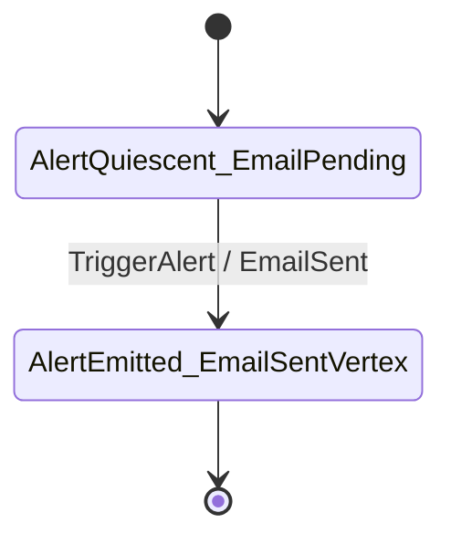

# AlertSource ⨾ EmailDelivery composite topology

Rendered by `Keiki.Render.Mermaid.toMermaidComposite` over the
`pipeline` value (`compose alertSource emailDelivery`) defined in
`test/Keiki/CompositionSpec.hs`. The pipeline lives in a test module
rather than the library, so refreshing this diagram requires loading
that module into ghci. To refresh:

    cabal repl keiki-test --repl-no-load
    ghci> :load Keiki.CompositionSpec
    ghci> import Keiki.Render.Mermaid (toMermaidComposite)
    ghci> import qualified Data.Text.IO as TIO
    ghci> TIO.putStrLn (toMermaidComposite Keiki.CompositionSpec.pipeline)

The composite has 4 vertices in total — the cross-product of
`AlertVertex` (`AlertQuiescent`, `AlertEmitted`) and `EmailVertex`
(`EmailPending`, `EmailSentVertex`). Of those four, only one
(`Composite AlertQuiescent EmailPending`) has an outgoing edge: the
single composite edge advances both component vertices in one step,
fed by `TriggerAlert` and emitting `EmailSent`. The other three
composite vertices have zero outgoing edges and are not final, so
the renderer omits them — same convention as `toMermaid` for any
unreachable / dead-end vertex.

The composite vertex labels are joined with an underscore
(`<show s1>_<show s2>`) rather than the `Composite a b` shape that
`Show (Composite s1 s2)` produces: Mermaid identifiers must match
`[A-Za-z_][A-Za-z0-9_]*`, and the space in `Composite a b` is not a
legal identifier character. See `compositeLabel` in
`src/Keiki/Render/Mermaid.hs`.

For the choice of flat cross-product over nested subgraphs (Mermaid
8.7+ `state … { … }` syntax with `Outer.Inner` dotted cross-cutting
transitions), see the Decision Log of
`docs/plans/31-mermaid-rendering-for-composite-symtransducers.md`.
