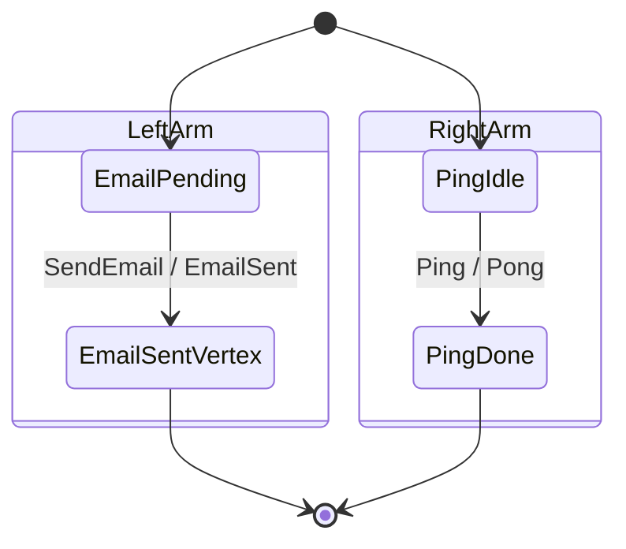

# EmailDelivery + Pinger alternative composite topology

Rendered by `Keiki.Render.Mermaid.toMermaidAlternative` over
`emailDelivery` (from `Jitsurei.EmailDelivery`) and `pinger`
(defined in `test/Keiki/CompositionAlternativeSpec.hs`). The Pinger
fixture lives in a test module rather than the library, so refreshing
this diagram requires loading that module into ghci. To refresh:

    cabal repl keiki-test --repl-no-load
    ghci> :load Keiki.CompositionAlternativeSpec
    ghci> import Keiki.Render.Mermaid (toMermaidAlternative)
    ghci> import Jitsurei.EmailDelivery (emailDelivery)
    ghci> import qualified Data.Text.IO as TIO
    ghci> TIO.putStrLn (toMermaidAlternative emailDelivery
                          Keiki.CompositionAlternativeSpec.pinger)

The composite's underlying vertex space is the cross-product
`Composite EmailVertex PingVertex` — four states. The diagram
presents the two arms as independent state machines because that is
how `Keiki.Composition.alternative` actually behaves at runtime: each
`Either`-tagged input advances exactly one arm and leaves the other
untouched. The two `[*]` arrows mark both arms as starting at their
respective initial vertices simultaneously; the two `--> [*]` arrows
likewise mark both arms' final vertices.

For the underlying composite's flat-cross-product variant (as
`toMermaidComposite` would render it), the layout would be a 4-vertex
line with same-outer edges visually crisscrossing — visually
confusing for `alternative`-shaped composites. The arm-separated
layout reads naturally: each arm's edges stay inside its own block,
and the cross-arm coupling is implicit (the runtime composite's
vertex is the cross-product, but the diagram presents two
independent machines that evolve as `Either`-tagged inputs arrive).

For the two-arm-naming choice and the design of the parallel-arms
layout, see the Decision Log of
`docs/plans/33-shape-aware-mermaid-renderers-for-alternative-and-feedback1-composites.md`.
The default arm names `LeftArm` / `RightArm` come from the side of
the `Either` they consume; pick more descriptive names with
`toMermaidAlternativeWith`.
