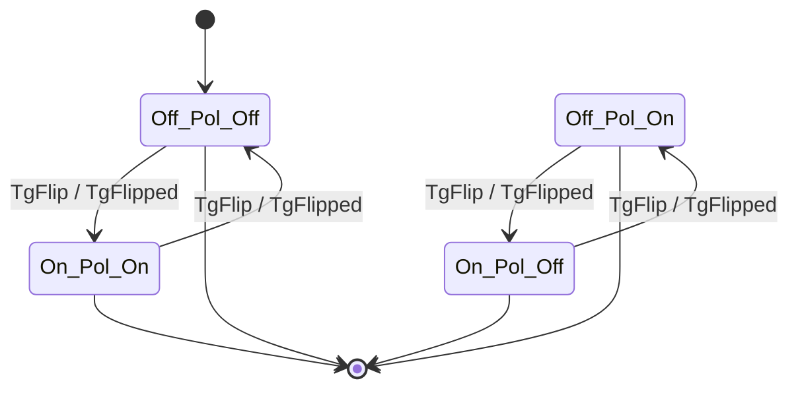

# Toggle ↔ Toggle-policy feedback1 cascade topology

Rendered by `Keiki.Render.Mermaid.toMermaidFeedback1` over
`toggleAgg` and `togglePolicy` (both defined in
`test/Keiki/CompositionFeedback1Spec.hs`). The fixtures live in a
test module rather than the library, so refreshing this diagram
requires loading that module into ghci. To refresh:

    cabal repl keiki-test --repl-no-load
    ghci> :load Keiki.CompositionFeedback1Spec
    ghci> import Keiki.Render.Mermaid (toMermaidFeedback1)
    ghci> import qualified Data.Text.IO as TIO
    ghci> TIO.putStrLn (toMermaidFeedback1
                          Keiki.CompositionFeedback1Spec.toggleAgg
                          Keiki.CompositionFeedback1Spec.togglePolicy)

The composite vertex is `Composite ToggleVertex (Composite
PolicyVertex ToggleVertex)` — outer toggle, then (policy, inner
toggle). The 3-deep flat label `<outer>_<policy>_<inner>` makes the
cascade visible: each edge advances all three components in one
atomic composite step (`feedback1 t f = compose t (compose f t)`),
so an input of `TgFlip` from `Off_Pol_Off` lands at `On_Pol_On` —
both toggles flipped, policy unchanged because it self-loops on
`Pol`.

The cross-product has `2 * 1 * 2 = 4` vertices. From the initial
vertex `Off_Pol_Off`, only `On_Pol_Off`'s sibling pair (`Off_Pol_Off`
and `On_Pol_On`) are reachable in two-step cycles — the cascade
keeps the inner and outer toggles in sync because the policy's
emitted command is a verbatim copy of the event the outer toggle
emitted. The other two cross-product vertices (`Off_Pol_On` and
`On_Pol_Off`) are unreachable from the initial state but the
renderer surfaces them because the static enumeration walks the
full vertex space — `toMermaidFeedback1` reports the topology, not
just the orbit of the initial vertex. The unreachable pair has
edges (since the cascade fires for every enumerated composite
vertex) and is final (since both `toggleAgg` and `togglePolicy` use
`isFinal = const True`).

For the design choice — flat 3-deep cross-product over a Shape-B
nested-subgraph layout for 3-deep — see the Decision Log of
`docs/plans/33-shape-aware-mermaid-renderers-for-alternative-and-feedback1-composites.md`.
