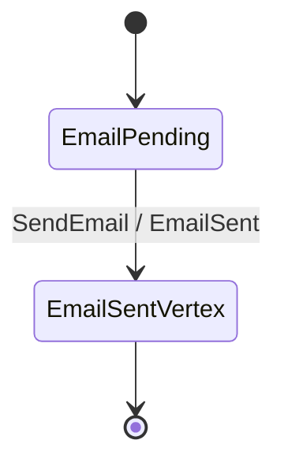

# Email Delivery topology

Rendered by `Keiki.Render.Mermaid.toTopologyMermaid` over
`Jitsurei.EmailDelivery.emailDelivery`. To refresh:

    cabal repl keiki
    ghci> import Keiki.Render.Mermaid (toTopologyMermaid)
    ghci> import Jitsurei.EmailDelivery (emailDelivery)
    ghci> import qualified Data.Text.IO as TIO
    ghci> TIO.putStrLn (toTopologyMermaid emailDelivery)

```mermaid
stateDiagram-v2
    [*] --> EmailPending
    EmailPending --> EmailSentVertex : SendEmail / EmailSent
    EmailSentVertex --> [*]
```

The deliberately minimal aggregate used by the composition test fixture
(`test/Keiki/CompositionSpec.hs:pipeline`) — one outgoing edge from one
vertex, terminating immediately. Its small shape isolates the
composition-mechanics tests from per-aggregate complexity.
