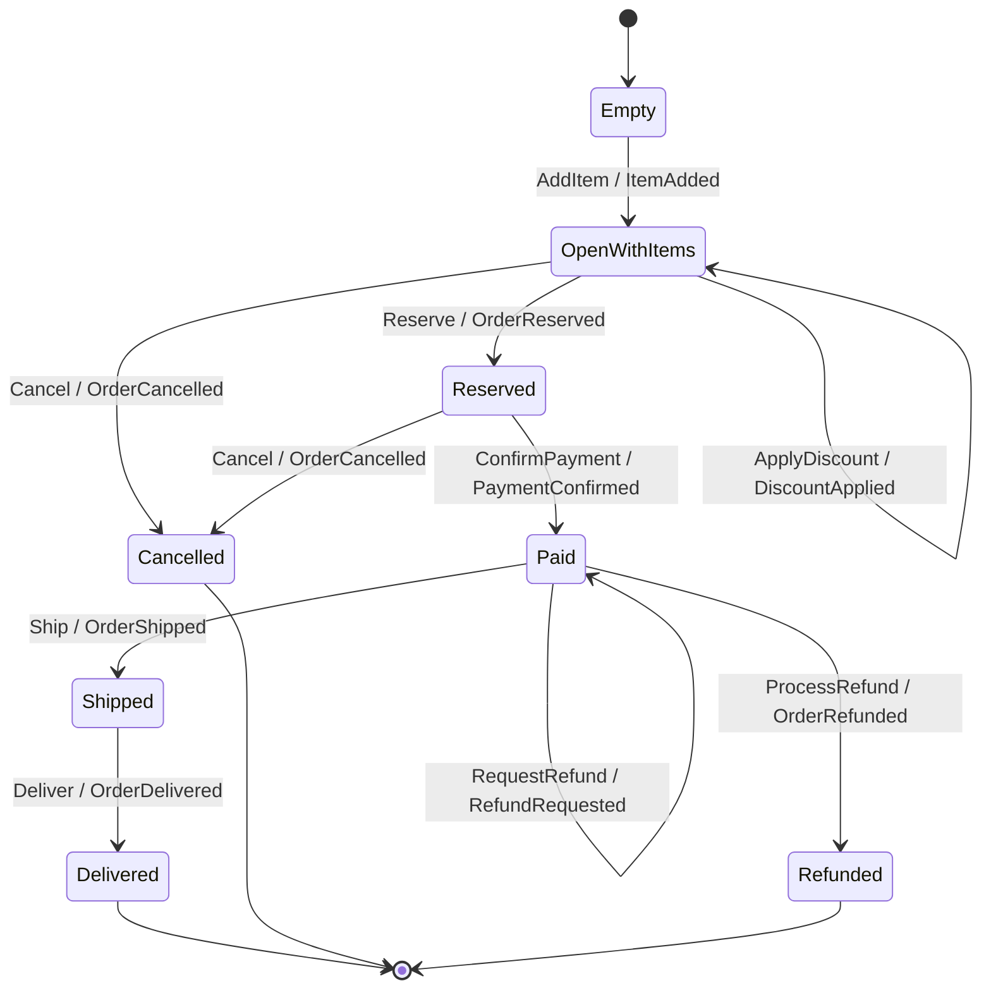

# Order / Cart topology

Rendered by `Keiki.Render.Mermaid.toMermaid` over
`Jitsurei.OrderCart.orderCart`. To refresh:

    cabal repl keiki
    ghci> import Keiki.Render.Mermaid (toMermaid)
    ghci> import Jitsurei.OrderCart (orderCart)
    ghci> import qualified Data.Text.IO as TIO
    ghci> TIO.putStrLn (toMermaid orderCart)

The lifecycle-shaped aggregate introduced by EP-22 to anchor the
benchmark suite. Three terminal vertices (`Delivered`, `Cancelled`,
`Refunded`); the `OpenWithItems` and `Paid` vertices each carry
self-loops (multiple edits / refund requests stay on the same vertex
while updating the register file). No ε-edges in this aggregate; every
transition emits a wire event.
