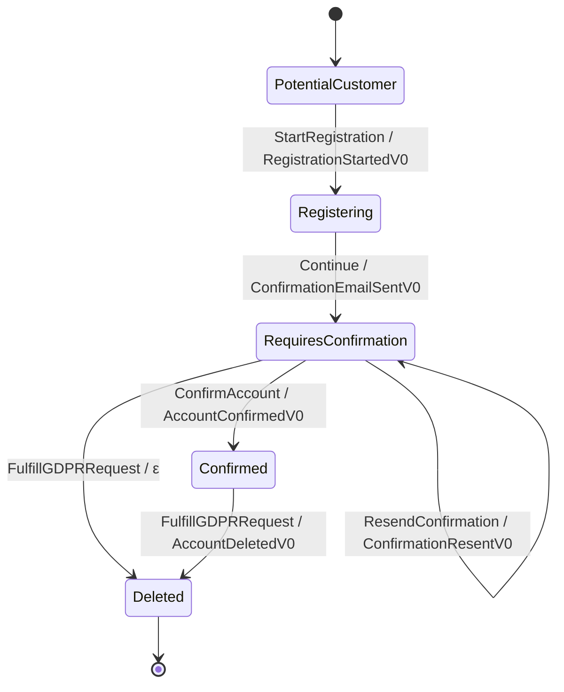

# User Registration V0 topology

Rendered by `Keiki.Render.Mermaid.toMermaid` over
`Keiki.Examples.UserRegistrationV0.userRegV0`. To refresh:

    cabal repl keiki
    ghci> import Keiki.Render.Mermaid (toMermaid)
    ghci> import Keiki.Examples.UserRegistrationV0 (userRegV0)
    ghci> import qualified Data.Text.IO as TIO
    ghci> TIO.putStrLn (toMermaid userRegV0)

`userRegV0` is the synthesis-§4 step-4 *unfixed* schema where
`AccountConfirmedV0` drops the `confirmCode` field. The topology is
identical to `userReg`; the divergence is on the wire-event payloads,
which `Keiki.Render.Mermaid.toMermaid` does not project. Run
`Keiki.Core.checkHiddenInputs userRegV0` to surface the inversion gap.
