# User Registration topology

Rendered by `Keiki.Render.Mermaid.toMermaid` over
`Jitsurei.UserRegistration.userReg`. To refresh:

    cabal repl keiki
    ghci> import Keiki.Render.Mermaid (toMermaid)
    ghci> import Jitsurei.UserRegistration (userReg)
    ghci> import qualified Data.Text.IO as TIO
    ghci> TIO.putStrLn (toMermaid userReg)

```mermaid
stateDiagram-v2
    [*] --> PotentialCustomer
    PotentialCustomer --> RequiresConfirmation : StartRegistration / RegistrationStarted; ConfirmationEmailSent
    RequiresConfirmation --> Confirmed : ConfirmAccount / AccountConfirmed
    RequiresConfirmation --> RequiresConfirmation : ResendConfirmation / ConfirmationResent
    RequiresConfirmation --> Deleted : FulfillGDPRRequest / ε
    Confirmed --> Deleted : FulfillGDPRRequest / AccountDeleted
    Deleted --> [*]
```

The `PotentialCustomer --> RequiresConfirmation` edge labelled
`StartRegistration / RegistrationStarted; ConfirmationEmailSent` is a
**multi-event edge**: one transition emits two events in declaration
order. Under the EP-19 GSM widening this is expressed as a single edge
with `output :: [OutTerm rs ci co]` of length 2. The `; ` separator in
the label is the Mermaid renderer's length-2 convention (length-3+
edges use Mermaid's ` ` multi-line label). See
[`multi-event-commands.md`](../multi-event-commands.md) for the
authoring guide.

The `RequiresConfirmation --> Deleted` edge labelled `FulfillGDPRRequest /
ε` is an ε-edge (no event emitted) — a GDPR delete request received before
confirmation tears the account down silently. Every other edge produces
one or more wire events named after the slash's right-hand side.
