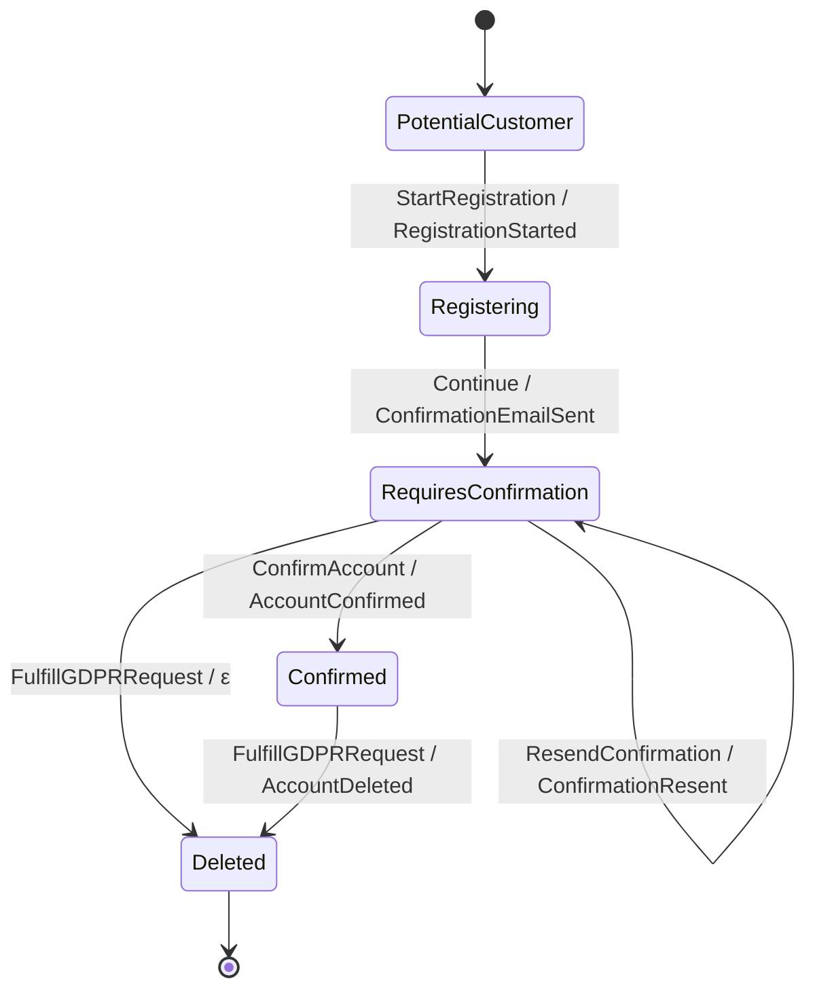

# User Registration topology

Rendered by `Keiki.Render.Mermaid.toMermaid` over
`Jitsurei.UserRegistration.userReg`. To refresh:

    cabal repl keiki
    ghci> import Keiki.Render.Mermaid (toMermaid)
    ghci> import Jitsurei.UserRegistration (userReg)
    ghci> import qualified Data.Text.IO as TIO
    ghci> TIO.putStrLn (toMermaid userReg)

The `RequiresConfirmation --> Deleted` edge labelled `FulfillGDPRRequest /
ε` is an ε-edge (no event emitted) — a GDPR delete request received before
confirmation tears the account down silently. Every other edge produces a
wire event named after the slash's right-hand side.
