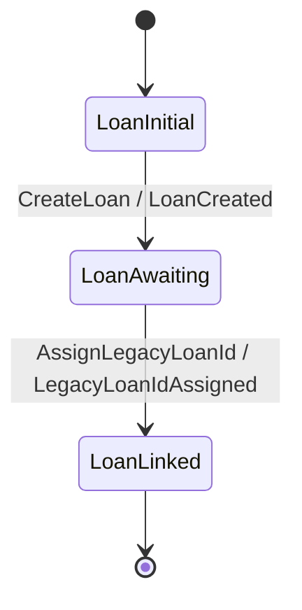
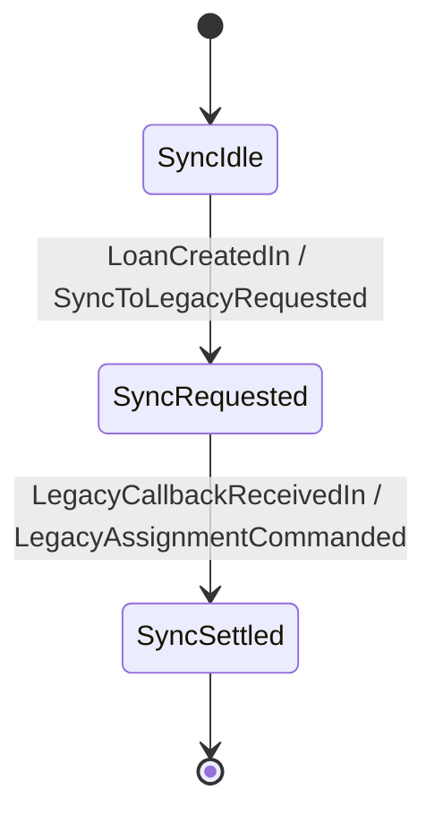

# Loan Application — a worked tutorial

This guide walks through a multi-aggregate workflow end to end: a
loan-underwriting pipeline that spans three aggregates and one
process manager. Each new keiki construct enters the story when the
domain has just made it necessary, not as a feature dump. By the end
you will have authored an aggregate that

- accumulates evidence (documents, credit checks, employment
  verifications) across many commands,
- advances on multi-field threshold guards
  (credit score ≥ 650 ∧ employment verified ∧ amount ≤ score-derived
  cap),
- uses an ε-edge (silent, no-event transition) for "internal
  progress that does not need a public event",
- exposes a per-vertex View whose live slots genuinely differ
  between control states,
- emits multi-event chains via `MultiDecider`, and
- composes with two more aggregates (a downstream Loan record and a
  CoreBankingSync Process) into one workflow via
  `Keiki.Composition.compose` plus two `lmapMaybeCi` adapters.

The reader is expected to have already read
[user-guide.md](user-guide.md). This tutorial cross-references it
for primitives the reader already knows and only re-explains things
the new domain introduces.

The complete code lives under `jitsurei/src/Jitsurei/`:
[`LoanApplication.hs`](../../jitsurei/src/Jitsurei/LoanApplication.hs),
[`Loan.hs`](../../jitsurei/src/Jitsurei/Loan.hs),
[`CoreBankingSync.hs`](../../jitsurei/src/Jitsurei/CoreBankingSync.hs),
[`LoanWorkflow.hs`](../../jitsurei/src/Jitsurei/LoanWorkflow.hs).

---

## 1. What we are building

Three aggregates wired sequentially:

```text
LoanApplication  ─ApplicationApproved→  CoreBankingSync  ─AssignLegacyLoanId→  Loan
```

- **LoanApplication** — the long-lived intake aggregate. The
  applicant submits documents, employment checks, and a credit-
  score query; once the thresholds are crossed the system advances
  to `UnderReview` and a runtime tick produces an
  `ApplicationApproved` (or `ApplicationDeclined`) event.
- **CoreBankingSync** — the process manager. It subscribes to
  `LoanCreated` events on the downstream Loan stream (in the
  pipeline, fed indirectly from `ApplicationApproved`), emits an
  audit `SyncToLegacyRequested` event so the runtime adapter knows
  to call the legacy core-banking system, and resolves the pending
  state when the legacy callback delivers a legacy loan id.
- **Loan** — the small downstream record that owns the loan's
  lifecycle. Carries an initially-unset `loanLegacyLoanId` slot
  populated when the CoreBankingSync Process commands the
  `AssignLegacyLoanId` step.

This pattern mirrors a production AgentQualification → QualifiedAgent
→ LegacyQaCreator workflow exactly. The keiki version is what the
formalism produces when you transcribe that shape into the symbolic-
register transducer.

---

## 2. Modelling the application aggregate

Start with the four authoring layers from
[user-guide.md §3](user-guide.md). The domain types sketch the wire
schema; the register file holds what the transducer must remember
between commands; the vertex enum encodes the workflow's coarse
state; the builder body wires everything into edges.

```haskell
-- jitsurei/src/Jitsurei/LoanApplication.hs

data StartApplicationData = StartApplicationData
  { applicantId     :: Text
  , requestedAmount :: Money     -- type Money = Int (curated Sym type)
  , purpose         :: Text
  , at              :: UTCTime
  } deriving (Eq, Show, Generic)

data LoanCmd
  = StartApplication      StartApplicationData
  | SubmitIncomeDocument  SubmitIncomeDocumentData
  | SubmitIdDocument      SubmitIdDocumentData
  | RecordCreditScore     RecordCreditScoreData
  | RecordEmploymentCheck RecordEmploymentCheckData
  | WithdrawApplication   WithdrawApplicationData
  | Continue                       -- the internal advancer
  deriving (Eq, Show, Generic)
```

The `Continue` constructor is the convention for an internal
advancer. The runtime issues it after every user command to drive
multi-event chains; we wire it in §6.

The vertex enum:

```haskell
data LoanAppVertex
  = Intake               -- single-uppercase prefix "i"
  | CollectingDocuments  -- "cd"
  | UnderReview          -- "ur"
  | Approved             -- "a"
  | Declined             -- "d"
  | Withdrawn            -- "w"
  deriving (Eq, Show, Enum, Bounded)
```

Note the prefix comments: `deriveView` (§5) requires every
constructor's `filter isUpper >>> map toLower` prefix to be unique,
so the natural name `Drafting` was renamed to `Intake` because both
`Drafting` and `Declined` would otherwise produce `"d"`. This is a
compile-time constraint of the splice; it forces the rename at
authoring time, not later.

The first edge — `StartApplication` writes the applicant identity,
the requested amount, and a stack of zero-initialised counters that
later guards will check:

```haskell
B.from Intake do
  B.onCmd inCtorStart $ \d -> B.do
    B.slot @"appApplicantId"        .= d.applicantId
    B.slot @"appRequestedAmount"    .= d.requestedAmount
    B.slot @"appPurpose"            .= d.purpose
    B.slot @"appIncomeDocCount"     .= lit 0
    B.slot @"appIdDocCount"         .= lit 0
    B.slot @"appCreditScore"        .= lit 0
    B.slot @"appEmploymentVerified" .= lit False
    B.emit wireApplicationStarted ApplicationStartedTermFields
      { applicantId     = d.applicantId
      , requestedAmount = d.requestedAmount
      , purpose         = d.purpose
      , at              = d.at
      }
    B.goto CollectingDocuments
```

`StartApplication` initialises the counter / Boolean slots
explicitly. `Keiki.Generics.emptyRegFile` pre-binds every slot to a
deferred `error "uninit: <slot>"`, so reading an unwritten slot
crashes loudly. The threshold guards in §4 read these slots, so
`StartApplication` must write them before any guard fires.

---

## 3. Accumulating evidence

The five evidence-collection edges all loop back to
`CollectingDocuments`. The two document-submission edges bump
counter slots via `TApp1 (+1)` — register arithmetic introduced in
[user-guide.md §3.4](user-guide.md):

```haskell
B.from CollectingDocuments do
  B.onCmd inCtorSubmitIncome $ \d -> B.do
    B.slot @"appIncomeDocCount" .= TApp1 (+ 1) #appIncomeDocCount
    B.emit wireIncomeDocumentReceived
      IncomeDocumentReceivedTermFields { docRef = d.docRef, at = d.at }
    B.goto CollectingDocuments

  B.onCmd inCtorSubmitId $ \d -> B.do
    B.slot @"appIdDocCount" .= TApp1 (+ 1) #appIdDocCount
    B.emit wireIdDocumentReceived
      IdDocumentReceivedTermFields { docRef = d.docRef, at = d.at }
    B.goto CollectingDocuments

  B.onCmd inCtorRecordScore $ \d -> B.do
    B.slot @"appCreditScore" .= d.score
    B.emit wireCreditScoreRecorded
      CreditScoreRecordedTermFields { score = d.score, at = d.at }
    B.goto CollectingDocuments

  B.onCmd inCtorRecordEmployment $ \d -> B.do
    B.slot @"appEmploymentVerified" .= d.verified
    B.emit wireEmploymentChecked
      EmploymentCheckedTermFields { verified = d.verified, at = d.at }
    B.goto CollectingDocuments

  -- and a Withdraw edge ...
```

Each edge updates exactly one slot and re-enters
`CollectingDocuments` — they are *self-loops* with side effects on
the register file. The runtime can apply these in any order; the
threshold guards in the next section depend only on the resulting
register state.

---

## 4. An ε-edge for "ready for review"

When all four thresholds are satisfied — two income documents, one
identity document, a recorded credit score, and a passing employment
check — the application should advance to `UnderReview` *without*
emitting a public event. There is no business meaning in
"`ApplicationStateChangedToReadyForReview`"; the change is purely
internal book-keeping. That is exactly the use case for an **ε-edge**
(see [user-guide.md §10.1](user-guide.md)) — an edge whose `output`
field is `Nothing`.

The keiki encoding uses `B.onCmd inCtorContinue` plus `B.noEmit`:

```haskell
  -- Inside `B.from CollectingDocuments do` (continued)
  B.onCmd inCtorContinue $ \_d -> B.do
    B.requireGuard readyForReviewGuard
    B.noEmit
    B.goto UnderReview
```

`B.onEpsilon` would be the textbook FST-style ε-edge (no input
symbol at all), but in keiki an ε-edge whose guard depends only on
the register file becomes ambiguous: if the guard happens to hold
when *any* user command arrives, both the user-keyed edge and the
ε-edge match, and `delta` returns `Nothing` for the ambiguity.
Keying the silent transition on `Continue` (an internal command the
runtime issues between user commands) keeps the symbolic mutual-
exclusion check honest. The same pattern appears in
`Jitsurei.UserRegistration`'s GDPR-from-`RequiresConfirmation` edge.

---

## 5. Multi-field threshold guards

The `readyForReviewGuard` is a conjunction of four register-side
predicates:

```haskell
readyForReviewGuard :: HsPred LoanAppRegs LoanCmd
readyForReviewGuard =
  PEq (TApp1 (>= minimumIncomeDocs)
        (proj (#appIncomeDocCount :: Index LoanAppRegs Int)))
      (lit True)
    `PAnd`
  PEq (TApp1 (>= minimumIdDocs)
        (proj (#appIdDocCount :: Index LoanAppRegs Int)))
      (lit True)
    `PAnd`
  PEq (TApp1 (>= 1) (proj (#appCreditScore :: Index LoanAppRegs Int)))
      (lit True)
    `PAnd`
  PEq (proj (#appEmploymentVerified :: Index LoanAppRegs Bool)) (lit True)
```

`HsPred` has no native comparison constructor, so `>=` and similar
relations are lifted via `TApp1`. The trade-off is documented:
`TApp1` over arbitrary Haskell functions translates to a *fresh*
anonymous SBV variable, so `isSingleValuedSym` cannot recognise that
two textually-identical `TApp1` terms refer to the same value. The
LoanApplication's symbolic spec (`LoanApplicationSymbolicSpec`) is
marked `pendingWith` for that reason — see the spec's module
haddock for the full caveat.

The approval branch uses a similar conjunction including a `TApp2`
(two-argument lift) for the `requestedAmount ≤ creditScore × 1000`
cap:

```haskell
approvalGuard :: HsPred LoanAppRegs LoanCmd
approvalGuard =
  PEq (TApp1 (>= approvalThresholdScore) (proj (#appCreditScore :: …)))
      (lit True)
    `PAnd`
  PEq (proj (#appEmploymentVerified :: …)) (lit True)
    `PAnd`
  PEq (TApp2 (<=)
        (proj (#appRequestedAmount :: …))
        (TApp1 maxApprovalForScore (proj (#appCreditScore :: …))))
      (lit True)
```

`UnderReview` then has two `Continue`-keyed edges — approve under
`approvalGuard`, decline under `PNot approvalGuard` — plus a
`Withdraw` edge.

---

## 6. Per-vertex View variance

The aggregate's "what slots are *live* at this vertex" answer
genuinely varies:

| Vertex                | Live slots                                                                  |
|-----------------------|-----------------------------------------------------------------------------|
| `Intake`              | `appApplicantId`                                                            |
| `CollectingDocuments` | `appApplicantId`, `appRequestedAmount`, `appPurpose`, doc counters           |
| `UnderReview`         | `appApplicantId`, `appRequestedAmount`, `appPurpose`, score, employment      |
| `Approved`            | `appApplicantId`, `appRequestedAmount`, `appCreditScore`, `appDecidedAt`     |
| `Declined`            | `appApplicantId`, `appDeclineReason`, `appDecidedAt`                         |
| `Withdrawn`           | `appApplicantId`, `appWithdrawnAt`                                           |

`deriveView` (see [b-views.md](b-views.md)) emits a singletons
`SLoanAppVertex` GADT, a parallel `LoanAppView` GADT with one
constructor per vertex, and a projection `loanAppView ::
SLoanAppVertex v -> RegFile LoanAppRegs -> LoanAppView v`:

```haskell
$(deriveView ''LoanAppVertex ''LoanAppRegs
    "SLoanAppVertex" "LoanAppView" "loanAppView"
    [ ("Intake",              ["appApplicantId"])
    , ("CollectingDocuments", [ "appApplicantId", "appRequestedAmount"
                              , "appPurpose", "appIncomeDocCount"
                              , "appIdDocCount" ])
    , ("UnderReview",         [ "appApplicantId", "appRequestedAmount"
                              , "appPurpose", "appCreditScore"
                              , "appEmploymentVerified" ])
    , ("Approved",            [ "appApplicantId", "appRequestedAmount"
                              , "appCreditScore", "appDecidedAt" ])
    , ("Declined",            [ "appApplicantId", "appDeclineReason"
                              , "appDecidedAt" ])
    , ("Withdrawn",           [ "appApplicantId", "appWithdrawnAt" ])
    ])
```

A reader of `loanAppView SApproved regs` sees only the four live
fields (`aAppApplicantId`, `aAppRequestedAmount`, `aAppCreditScore`,
`aAppDecidedAt`) — the type system blocks even *asking* the
projection for `aAppPurpose` from an `Approved` vertex.

---

## 7. Multi-event commands via `MultiDecider`

The application has internal vertices (`CollectingDocuments`,
`UnderReview`) where the runtime should drain Continue-driven
chains rather than surface intermediate states. The
`MultiDecider` façade (see
[user-guide.md §6](user-guide.md)) handles that:

```haskell
loanApplicationDriverConfig :: DriverConfig LoanAppVertex LoanCmd
loanApplicationDriverConfig = DriverConfig
  { isInternal = \v -> case v of
      CollectingDocuments -> Just Continue
      UnderReview         -> Just Continue
      _                   -> Nothing
  }
```

With this configuration, a single `RecordEmploymentCheck` command on
threshold-poised registers produces a 2-event chain:

```haskell
let mdec = toMultiDecider loanApplication loanApplicationDriverConfig
    cmd  = RecordEmploymentCheck (RecordEmploymentCheckData True (t 50))
decide mdec cmd preApprovalState
-- ⇒ [EmploymentChecked …, ApplicationApproved …]
```

The first event is the `RecordEmploymentCheck` itself; the second is
the result of `Continue`-Continue chaining through `CollectingDocuments`
(silent advance, no event) and `UnderReview` (approval edge fires,
emits `ApplicationApproved`). The silent edge contributes no event
to the chunk, only a vertex transition.

`Jitsurei.LoanApplicationChained` shows the `chainTo` syntax for the
same shape; it produces an edge-equivalent transducer.

---

## 8. The downstream Loan aggregate

Tiny by design. Two transitions:

```haskell
data LoanCmd'
  = CreateLoan          CreateLoanData         -- creates the loan record
  | AssignLegacyLoanId  AssignLegacyLoanIdData -- populates the legacy id
  deriving (Eq, Show, Generic)
```



We keep `Loan` as a separate aggregate even though it has only two
edges because *its lifecycle is independent of the application's*. A
loan once created may be edited, refinanced, or charged off long
after `LoanApplication.Approved` was reached. The application
aggregate is the *intake* boundary; the loan aggregate is the
*account* boundary. Different identifiers, different consistency
rules, different retention policies.

The constructor names are primed (`LoanCmd'`, `LoanEvent'`) to avoid
colliding with `Jitsurei.LoanApplication.LoanCmd` /
`LoanEvent` if a reader imports both modules unqualified.

---

## 9. The CoreBankingSync Process

A *Process* in keiki has the same shape as any aggregate, with two
twists: its input alphabet is *events* from one bounded context, and
its output alphabet is *commands* (or audit events) for another.

```haskell
data SyncInput
  = LoanCreatedIn             LoanCreatedInData
  | LegacyCallbackReceivedIn  LegacyCallbackReceivedInData
  deriving (Eq, Show, Generic)

data SyncOutput
  = SyncToLegacyRequested      SyncToLegacyRequestedData
  | LegacyAssignmentCommanded  LegacyAssignmentCommandedData  -- carries a LoanCmd'
  deriving (Eq, Show, Generic)
```

The Process state machine:



The idempotency mechanism is entirely in the structure: the
`LegacyCallbackReceivedIn` edge carries a `requireEq d.loanId
#syncPendingLoanId` guard that compares the callback's `loanId`
against the pending-state slot. A duplicate callback after settle
finds `SyncSettled` to be terminal (no outgoing edges); a callback
with a mismatched loanId fails `requireEq` and `delta` returns
`Nothing`. Both cases are tested in
`Jitsurei.CoreBankingSyncSpec`.

This is a literal transcription of the production
`MlsService.LegacyQaCreator.Process` shape (the `[Action]`
register slot becomes one keiki slot; the request/completion event
pair becomes two edges; the natural-key idempotency becomes the
`requireEq` guard).

---

## 10. Wiring it together with `compose`

`Keiki.Composition.compose t1 t2` produces a transducer whose input
is `t1`'s input, whose output is `t2`'s output, and whose vertex is
the product `Composite s1 s2`. It type-checks only when t1's output
*equals* t2's input. For our pipeline the alphabets do not match
out of the box:

- LoanApplication outputs `LoanEvent`; CoreBankingSync inputs
  `SyncInput`.
- CoreBankingSync outputs `SyncOutput`; Loan inputs `LoanCmd'`.

`Keiki.Profunctor.lmapMaybeCi` fills the gap — it rewrites a
transducer's edges so they fail their input-ctor match for inputs
the supplied adapter returns `Nothing` for. Two adapters:

```haskell
loanEventToSyncInput :: LoanEvent -> Maybe SyncInput
loanEventToSyncInput (ApplicationApproved a) =
  Just (LoanCreatedIn (LoanCreatedInData
    { loanId      = "loan-" <> a.applicantId
    , applicantId = a.applicantId
    , principal   = a.requestedAmount
    }))
loanEventToSyncInput _ = Nothing

syncOutputToLoanCmd :: SyncOutput -> Maybe LoanCmd'
syncOutputToLoanCmd (LegacyAssignmentCommanded d) = Just d.assignment
syncOutputToLoanCmd (SyncToLegacyRequested  _)    = Nothing
```

The composite:

```haskell
loanWorkflow :: SymTransducer
                  (HsPred (Append LoanAppRegs (Append SyncRegs LoanRegs)) LoanCmd)
                  (Append LoanAppRegs (Append SyncRegs LoanRegs))
                  (Composite LoanAppVertex (Composite SyncVertex LoanVertex))
                  LoanCmd
                  LoanEvent'
loanWorkflow =
  loanApplication
    `compose`
  lmapMaybeCi loanEventToSyncInput
    (coreBankingSync `compose` lmapMaybeCi syncOutputToLoanCmd loan)
```

### A variance caveat (important)

`compose` is **lockstep**: every non-ε composite edge fires *both*
legs simultaneously. Cross-context creation is naturally async — a
real LoanCmd-driven flow is

1. The user issues LoanCmds; LoanApplication advances and finally
   emits `ApplicationApproved`.
2. The runtime adapter observes `ApplicationApproved`, *separately*
   creates a Loan record (with a freshly-minted loanId) and feeds
   `LoanCreatedIn` to CoreBankingSync.
3. CoreBankingSync emits `SyncToLegacyRequested`; the runtime calls
   the legacy core-banking system and waits for the callback.
4. The legacy callback delivers `LegacyCallbackReceivedIn`, which
   `Jitsurei.CoreBankingSync` turns into
   `LegacyAssignmentCommanded` on the Loan stream.
5. The Loan aggregate processes `AssignLegacyLoanId` and emits
   `LegacyLoanIdAssigned`.

Steps 1–5 take place across multiple commands and external events.
`compose`'s lockstep semantics cannot model that natural flow as a
single composite firing. The `loanWorkflow` definition is therefore
a **type-level wiring diagram** showing how the alphabets line up;
the runtime adapter calls each aggregate independently, using the
same adapter functions (`loanEventToSyncInput`,
`syncOutputToLoanCmd`) at the boundaries.

`Jitsurei.LoanWorkflowSpec` exercises the end-to-end flow by driving
each stage directly through these adapter functions, mirroring what
the runtime does. This is the spec to read if you want to understand
the cross-context choreography concretely.

### The shape of the composite

Pinned by `Jitsurei.Render.MermaidLoanSpec` and rendered to disk at
`docs/guide/diagrams/loan-workflow-nested.mmd`. The diagram groups
the 6 × 3 × 3 = 54 cross-product vertices under the six outer
`LoanAppVertex` aggregates, then lists every reachable composite
edge at the top level. The flat-form sibling lives at
`docs/guide/diagrams/loan-workflow.mmd` if you prefer one un-grouped
list of transitions; both are produced by
`Keiki.Render.Mermaid.toMermaidCompose3{,Nested}` from the same
`loanWorkflow` value:

```mermaid
stateDiagram-v2
    [*] --> Intake_SyncIdle_LoanInitial
    state Intake {
        Intake_SyncIdle_LoanInitial
        Intake_SyncIdle_LoanAwaiting
        Intake_SyncIdle_LoanLinked
        Intake_SyncRequested_LoanInitial
        Intake_SyncRequested_LoanAwaiting
        Intake_SyncRequested_LoanLinked
        Intake_SyncSettled_LoanInitial
        Intake_SyncSettled_LoanAwaiting
        Intake_SyncSettled_LoanLinked
    }
    state CollectingDocuments {
        CollectingDocuments_SyncIdle_LoanInitial
        CollectingDocuments_SyncIdle_LoanAwaiting
        CollectingDocuments_SyncIdle_LoanLinked
        CollectingDocuments_SyncRequested_LoanInitial
        CollectingDocuments_SyncRequested_LoanAwaiting
        CollectingDocuments_SyncRequested_LoanLinked
        CollectingDocuments_SyncSettled_LoanInitial
        CollectingDocuments_SyncSettled_LoanAwaiting
        CollectingDocuments_SyncSettled_LoanLinked
    }
    state UnderReview {
        UnderReview_SyncIdle_LoanInitial
        UnderReview_SyncIdle_LoanAwaiting
        UnderReview_SyncIdle_LoanLinked
        UnderReview_SyncRequested_LoanInitial
        UnderReview_SyncRequested_LoanAwaiting
        UnderReview_SyncRequested_LoanLinked
        UnderReview_SyncSettled_LoanInitial
        UnderReview_SyncSettled_LoanAwaiting
        UnderReview_SyncSettled_LoanLinked
    }
    state Approved {
        Approved_SyncIdle_LoanInitial
        Approved_SyncIdle_LoanAwaiting
        Approved_SyncIdle_LoanLinked
        Approved_SyncRequested_LoanInitial
        Approved_SyncRequested_LoanAwaiting
        Approved_SyncRequested_LoanLinked
        Approved_SyncSettled_LoanInitial
        Approved_SyncSettled_LoanAwaiting
        Approved_SyncSettled_LoanLinked
    }
    state Declined {
        Declined_SyncIdle_LoanInitial
        Declined_SyncIdle_LoanAwaiting
        Declined_SyncIdle_LoanLinked
        Declined_SyncRequested_LoanInitial
        Declined_SyncRequested_LoanAwaiting
        Declined_SyncRequested_LoanLinked
        Declined_SyncSettled_LoanInitial
        Declined_SyncSettled_LoanAwaiting
        Declined_SyncSettled_LoanLinked
    }
    state Withdrawn {
        Withdrawn_SyncIdle_LoanInitial
        Withdrawn_SyncIdle_LoanAwaiting
        Withdrawn_SyncIdle_LoanLinked
        Withdrawn_SyncRequested_LoanInitial
        Withdrawn_SyncRequested_LoanAwaiting
        Withdrawn_SyncRequested_LoanLinked
        Withdrawn_SyncSettled_LoanInitial
        Withdrawn_SyncSettled_LoanAwaiting
        Withdrawn_SyncSettled_LoanLinked
    }
    Intake_SyncIdle_LoanInitial --> CollectingDocuments_SyncRequested_LoanAwaiting : StartApplication / LoanCreated
    Intake_SyncIdle_LoanInitial --> Withdrawn_SyncRequested_LoanAwaiting : WithdrawApplication / LoanCreated
    Intake_SyncIdle_LoanAwaiting --> CollectingDocuments_SyncRequested_LoanLinked : StartApplication / LegacyLoanIdAssigned
    Intake_SyncIdle_LoanAwaiting --> Withdrawn_SyncRequested_LoanLinked : WithdrawApplication / LegacyLoanIdAssigned
    Intake_SyncRequested_LoanInitial --> CollectingDocuments_SyncSettled_LoanAwaiting : StartApplication / LoanCreated
    Intake_SyncRequested_LoanInitial --> Withdrawn_SyncSettled_LoanAwaiting : WithdrawApplication / LoanCreated
    Intake_SyncRequested_LoanAwaiting --> CollectingDocuments_SyncSettled_LoanLinked : StartApplication / LegacyLoanIdAssigned
    Intake_SyncRequested_LoanAwaiting --> Withdrawn_SyncSettled_LoanLinked : WithdrawApplication / LegacyLoanIdAssigned
    CollectingDocuments_SyncIdle_LoanInitial --> CollectingDocuments_SyncRequested_LoanAwaiting : SubmitIncomeDocument / LoanCreated
    CollectingDocuments_SyncIdle_LoanInitial --> CollectingDocuments_SyncRequested_LoanAwaiting : SubmitIdDocument / LoanCreated
    CollectingDocuments_SyncIdle_LoanInitial --> CollectingDocuments_SyncRequested_LoanAwaiting : RecordCreditScore / LoanCreated
    CollectingDocuments_SyncIdle_LoanInitial --> CollectingDocuments_SyncRequested_LoanAwaiting : RecordEmploymentCheck / LoanCreated
    CollectingDocuments_SyncIdle_LoanInitial --> Withdrawn_SyncRequested_LoanAwaiting : WithdrawApplication / LoanCreated
    CollectingDocuments_SyncIdle_LoanInitial --> UnderReview_SyncIdle_LoanInitial : Continue / ε
    CollectingDocuments_SyncIdle_LoanAwaiting --> CollectingDocuments_SyncRequested_LoanLinked : SubmitIncomeDocument / LegacyLoanIdAssigned
    CollectingDocuments_SyncIdle_LoanAwaiting --> CollectingDocuments_SyncRequested_LoanLinked : SubmitIdDocument / LegacyLoanIdAssigned
    CollectingDocuments_SyncIdle_LoanAwaiting --> CollectingDocuments_SyncRequested_LoanLinked : RecordCreditScore / LegacyLoanIdAssigned
    CollectingDocuments_SyncIdle_LoanAwaiting --> CollectingDocuments_SyncRequested_LoanLinked : RecordEmploymentCheck / LegacyLoanIdAssigned
    CollectingDocuments_SyncIdle_LoanAwaiting --> Withdrawn_SyncRequested_LoanLinked : WithdrawApplication / LegacyLoanIdAssigned
    CollectingDocuments_SyncIdle_LoanAwaiting --> UnderReview_SyncIdle_LoanAwaiting : Continue / ε
    CollectingDocuments_SyncIdle_LoanLinked --> UnderReview_SyncIdle_LoanLinked : Continue / ε
    CollectingDocuments_SyncRequested_LoanInitial --> CollectingDocuments_SyncSettled_LoanAwaiting : SubmitIncomeDocument / LoanCreated
    CollectingDocuments_SyncRequested_LoanInitial --> CollectingDocuments_SyncSettled_LoanAwaiting : SubmitIdDocument / LoanCreated
    CollectingDocuments_SyncRequested_LoanInitial --> CollectingDocuments_SyncSettled_LoanAwaiting : RecordCreditScore / LoanCreated
    CollectingDocuments_SyncRequested_LoanInitial --> CollectingDocuments_SyncSettled_LoanAwaiting : RecordEmploymentCheck / LoanCreated
    CollectingDocuments_SyncRequested_LoanInitial --> Withdrawn_SyncSettled_LoanAwaiting : WithdrawApplication / LoanCreated
    CollectingDocuments_SyncRequested_LoanInitial --> UnderReview_SyncRequested_LoanInitial : Continue / ε
    CollectingDocuments_SyncRequested_LoanAwaiting --> CollectingDocuments_SyncSettled_LoanLinked : SubmitIncomeDocument / LegacyLoanIdAssigned
    CollectingDocuments_SyncRequested_LoanAwaiting --> CollectingDocuments_SyncSettled_LoanLinked : SubmitIdDocument / LegacyLoanIdAssigned
    CollectingDocuments_SyncRequested_LoanAwaiting --> CollectingDocuments_SyncSettled_LoanLinked : RecordCreditScore / LegacyLoanIdAssigned
    CollectingDocuments_SyncRequested_LoanAwaiting --> CollectingDocuments_SyncSettled_LoanLinked : RecordEmploymentCheck / LegacyLoanIdAssigned
    CollectingDocuments_SyncRequested_LoanAwaiting --> Withdrawn_SyncSettled_LoanLinked : WithdrawApplication / LegacyLoanIdAssigned
    CollectingDocuments_SyncRequested_LoanAwaiting --> UnderReview_SyncRequested_LoanAwaiting : Continue / ε
    CollectingDocuments_SyncRequested_LoanLinked --> UnderReview_SyncRequested_LoanLinked : Continue / ε
    CollectingDocuments_SyncSettled_LoanInitial --> UnderReview_SyncSettled_LoanInitial : Continue / ε
    CollectingDocuments_SyncSettled_LoanAwaiting --> UnderReview_SyncSettled_LoanAwaiting : Continue / ε
    CollectingDocuments_SyncSettled_LoanLinked --> UnderReview_SyncSettled_LoanLinked : Continue / ε
    UnderReview_SyncIdle_LoanInitial --> Approved_SyncRequested_LoanAwaiting : Continue / LoanCreated
    UnderReview_SyncIdle_LoanInitial --> Declined_SyncRequested_LoanAwaiting : Continue / LoanCreated
    UnderReview_SyncIdle_LoanInitial --> Withdrawn_SyncRequested_LoanAwaiting : WithdrawApplication / LoanCreated
    UnderReview_SyncIdle_LoanAwaiting --> Approved_SyncRequested_LoanLinked : Continue / LegacyLoanIdAssigned
    UnderReview_SyncIdle_LoanAwaiting --> Declined_SyncRequested_LoanLinked : Continue / LegacyLoanIdAssigned
    UnderReview_SyncIdle_LoanAwaiting --> Withdrawn_SyncRequested_LoanLinked : WithdrawApplication / LegacyLoanIdAssigned
    UnderReview_SyncRequested_LoanInitial --> Approved_SyncSettled_LoanAwaiting : Continue / LoanCreated
    UnderReview_SyncRequested_LoanInitial --> Declined_SyncSettled_LoanAwaiting : Continue / LoanCreated
    UnderReview_SyncRequested_LoanInitial --> Withdrawn_SyncSettled_LoanAwaiting : WithdrawApplication / LoanCreated
    UnderReview_SyncRequested_LoanAwaiting --> Approved_SyncSettled_LoanLinked : Continue / LegacyLoanIdAssigned
    UnderReview_SyncRequested_LoanAwaiting --> Declined_SyncSettled_LoanLinked : Continue / LegacyLoanIdAssigned
    UnderReview_SyncRequested_LoanAwaiting --> Withdrawn_SyncSettled_LoanLinked : WithdrawApplication / LegacyLoanIdAssigned
    Approved_SyncSettled_LoanLinked --> [*]
    Declined_SyncSettled_LoanLinked --> [*]
    Withdrawn_SyncSettled_LoanLinked --> [*]
```



The composite has only three terminal vertices —
`Approved_SyncSettled_LoanLinked`, `Declined_SyncSettled_LoanLinked`,
`Withdrawn_SyncSettled_LoanLinked` — i.e. the three terminal
LoanApplication outcomes paired with a fully-settled CoreBankingSync
and a fully-linked Loan. The vertices reachable from the initial
state are a strict subset of the cross-product enumeration; the
diagram lists every cross-product vertex under each outer block to
make the full state space visible (the renderer walks
`[minBound .. maxBound]`, not just the reachable set), and only
emits transitions that actually exist.

---

## 11. Where to go from here

- **The companion specs** (`jitsurei/test/Jitsurei/LoanApplication*Spec.hs`,
  `Loan*Spec.hs`, `CoreBankingSync*Spec.hs`, `LoanWorkflowSpec.hs`)
  show concrete usage of every section above. Read
  `LoanWorkflowSpec.hs` end-to-end after this tutorial.
- **The other combinators.** [composition.md](composition.md)
  covers `alternative` (parallel arms) and `feedback1` (single-step
  reductions) in addition to the sequential `compose` used here.
- **Symbolic CI.** [symbolic-ci.md](symbolic-ci.md) walks through
  wiring `isSingleValuedSym` into a CI image. The LoanApplication's
  symbolic spec is currently `pendingWith` because of `TApp1` /
  `TApp2` limitations in the SBV backend; that spec is a useful
  template for what the symbolic gate looks like when it *does*
  hold (as in `Jitsurei.UserRegistration`).
- **Per-vertex views.** [b-views.md](b-views.md) covers
  `deriveView` in depth, including the validation rules that gave
  rise to this tutorial's `Drafting → Intake` rename.
- **The formal foundation.** Reading order for the design notes is
  laid out in [docs/foundations/06-where-to-go-next.md](../foundations/06-where-to-go-next.md).
- **The plan that produced this tutorial.**
  [docs/plans/34-loan-application-worked-example-with-cross-context-process-and-tutorial.md](../plans/34-loan-application-worked-example-with-cross-context-process-and-tutorial.md)
  records every decision and surprise discovered during
  implementation.
