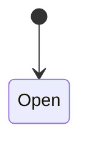
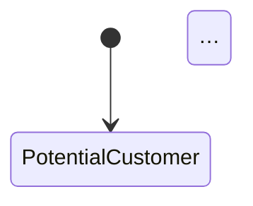
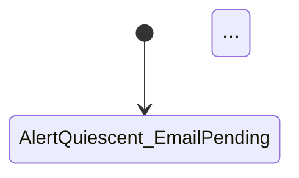

# Mermaid diagram atlas sections and Markdown marker replacement helper

This ExecPlan is a living document. The sections Progress, Surprises & Discoveries,
Decision Log, and Outcomes & Retrospective must be kept up to date as work proceeds.


## Purpose / Big Picture

A downstream project that owns several keiki transducers — for example a disaster-response
runtime with an Incident-Command aggregate, a Hospital-Capacity aggregate, and one or more
process managers — wants to publish all of their Mermaid diagrams into a single checked-in
Markdown file and to regenerate that file mechanically. Today keiki gives them
`toMermaidAtlas`, which takes a flat list of `(title, diagram)` pairs and emits one `## title`
heading plus a fenced ```` ```mermaid ```` block per pair. That is enough to glue diagrams
together, but it loses two things the downstream team asked for: it cannot say *what kind* of
diagram each section is (an aggregate state diagram, a process-manager diagram, a workflow
diagram, or something custom), and it gives each section no stable identifier that a
regeneration step could target to rewrite just that one block in place. Without a stable
identifier the only way to refresh a diagram is to regenerate the whole document, which loses
any hand-written prose around the diagrams.

After this change two new, independent capabilities exist, both living under
`src/Keiki/Render/`:

The first is a *typed diagram atlas*. A caller builds a list of `MermaidSection` values — each
carrying a stable `sectionId`, a human title, a `MermaidSectionKind`
(`AggregateDiagram`, `ProcessManagerDiagram`, `WorkflowDiagram`, or `CustomDiagram label`),
and the already-rendered diagram `Text` — and calls
`toMermaidAtlasWith options sections` to assemble one Markdown document. The output can
optionally carry a top-level title, can label each section with its kind (visibly or as an
HTML comment), and can wrap each section's diagram in begin/end markers keyed by `sectionId`.
The caller can now look at the generated atlas and tell an aggregate diagram from a
process-manager diagram, and the section ids are stable across regenerations.

The second is a *Markdown marker-replacement helper*, `replaceMarkdownDiagramBlock`, in a new
module `src/Keiki/Render/Markdown.hs`. Given an existing Markdown document that contains a
matched pair of HTML-comment markers — `<!-- {namespace}: {id} begin -->` and
`<!-- {namespace}: {id} end -->` — it replaces everything *between* those markers with a
freshly normalized fenced code block, leaving every byte outside the marked region untouched.
The markers themselves are preserved. This lets a downstream regeneration step rewrite exactly
one diagram inside a hand-maintained document and prove, byte-for-byte, that nothing else
moved.

The two capabilities are designed to compose: an atlas section emitted with markers uses its
own `sectionId` as the marker id, so `replaceMarkdownDiagramBlock` can later update that exact
block. The user can see both working through new golden/unit tests (a multi-section atlas that
distinguishes kinds, and a before/after replacement that preserves surrounding prose) and by
reading the rendered output shown in this plan.

The load-bearing invariant: the existing `toMermaidAtlas` output and its golden test must stay
**byte-identical**. All new behavior is opt-in via `toMermaidAtlasWith` and the new module.


## Progress

Use a checklist to summarize granular steps. Every stopping point must be documented here,
even if it requires splitting a partially completed task into two ("done" vs. "remaining").
This section must always reflect the actual current state of the work.

- [x] M1: Read `src/Keiki/Render/Mermaid.hs` around lines 676-696 to confirm the current `toMermaidAtlas` shape before editing. (Confirmed at `Mermaid.hs:1017-1028`.)
- [x] M1: Add `MermaidSectionKind`, `MermaidSection`, `MermaidAtlasOptions`, `defaultMermaidAtlasOptions`, and `toMermaidAtlasWith` to `src/Keiki/Render/Mermaid.hs`. (Plus `AtlasKindDisplay` and the private `renderSection`/`kindText` helpers.)
- [x] M1: Re-express `toMermaidAtlas` in terms of `toMermaidAtlasWith defaultMermaidAtlasOptions` and verify it is byte-identical to the old definition. (Pre-existing `atlasCanonical` golden still passes.)
- [x] M1: Extend the module export list in `src/Keiki/Render/Mermaid.hs` with the new names.
- [x] M1: Add a new multi-section atlas golden to `test/Keiki/Render/MermaidSpec.hs`; leave the existing `atlasCanonical` golden untouched. (`typedAtlasCanonical`.)
- [x] M1: Run `cabal build keiki` and `cabal test keiki-test`; confirm the pre-existing atlas golden still passes. (357 examples, 0 failures.)
- [ ] M2: Create `src/Keiki/Render/Markdown.hs` with `MarkdownDiagramBlock`, `MarkdownDiagramError`, and `replaceMarkdownDiagramBlock`.
- [ ] M2: Add `Keiki.Render.Markdown` to `keiki.cabal` `library: exposed-modules`.
- [ ] M2: Create `test/Keiki/Render/MarkdownSpec.hs`; add it to the test-suite `other-modules` and wire it into `test/Spec.hs`.
- [ ] M2: Run `cabal test keiki-test`; confirm the missing-begin, missing-end, duplicate-marker, outside-preservation, and normalized-output cases pass.
- [ ] M2: Confirm idempotence: replacing twice yields the same document.
- [ ] Commit with the MasterPlan / ExecPlan / Intention trailers.


## Surprises & Discoveries

Document unexpected behaviors, bugs, optimizations, or insights discovered during
implementation. Provide concise evidence.

(None yet.)


## Decision Log

Record every decision made while working on the plan.

- Decision: `MermaidAtlasOptions` carries exactly five fields:
  `atlasTitle :: Maybe Text`, `atlasSectionHeadingLevel :: Int`,
  `atlasShowSectionKind :: AtlasKindDisplay`, `atlasWrapMarkers :: Maybe Text`, and
  `atlasFenceLanguage :: Text`.
  Rationale: The audit names `MermaidAtlasOptions` but does not define it, so the shape is
  designed here, kept minimal, with each field justified. `atlasTitle` lets a caller prepend a
  single top-level heading above all sections (the old `toMermaidAtlas` had none, so the default
  is `Nothing`). `atlasSectionHeadingLevel` controls the heading depth for each section; the old
  function hard-codes a level-2 (`## `) heading, so the default is `2`, which keeps the existing
  output identical. `atlasShowSectionKind` (an `AtlasKindDisplay = KindHidden | KindAsLabel |
  KindAsComment`) decides whether a section's `MermaidSectionKind` is rendered, and if so whether
  as a visible italic label line or as an HTML comment that does not show in rendered Markdown;
  the old function emitted no kind, so the default is `KindHidden`. `atlasWrapMarkers :: Maybe
  Text` decides whether each section's diagram is wrapped in begin/end markers, and if so under
  what namespace; the marker id is the section's `sectionId`, tying Req 4 to Req 5. The old
  function emitted no markers, so the default is `Nothing`. `atlasFenceLanguage :: Text` is the
  fenced-block language tag; the old function hard-codes `mermaid`, so the default is `"mermaid"`.
  Date: 2026-06-06

- Decision: Re-express `toMermaidAtlas xs = toMermaidAtlasWith defaultMermaidAtlasOptions (map
  toSection xs)` rather than keeping it independent, where `toSection (i, (title, diagram))`
  builds a `MermaidSection` whose `sectionId` is a generated token, kind is `CustomDiagram ""`,
  title is `title`, and diagram is `diagram`.
  Rationale: With `defaultMermaidAtlasOptions` (no title, heading level 2, kind hidden, no
  markers, language `mermaid`), `toMermaidAtlasWith` must produce, per section, exactly
  `## {title}\n\n```mermaid\n{diagram}\n```` and join sections with `\n\n` — byte-identical to the
  current definition at `src/Keiki/Render/Mermaid.hs:690-696`. Because `sectionId` is consulted
  only when `atlasWrapMarkers` is `Just`, and kind only when `atlasShowSectionKind /= KindHidden`,
  neither appears in the default output, so the generated id and the `CustomDiagram` kind never
  reach the bytes. This reconciles cleanly, so the independent-definition fallback the prompt
  permits is NOT needed. The byte-identity is asserted by leaving the existing `atlasCanonical`
  golden unchanged and adding a new golden for the typed-section behavior.
  Date: 2026-06-06

- Decision: The normalized fenced block produced by `replaceMarkdownDiagramBlock` is exactly
  ``` "```" <> blockLanguage <> "\n" <> stripTrailingNewlines blockContent <> "\n```" ```, placed
  on its own lines between the (preserved) begin and end markers, with a single `\n` separating
  the begin marker from the fence-open and the fence-close from the end marker.
  Rationale: A deterministic, golden-testable normal form is required by the acceptance
  ("replacement normalizes the generated fenced block consistently"). Trailing newlines in
  `blockContent` are stripped before the closing fence so that whether the caller's rendered
  diagram ends in a newline or not, the emitted block is identical — which is what makes the
  helper idempotent (replacing the just-written block reproduces it exactly). The language tag is
  taken verbatim from `blockLanguage`.
  Date: 2026-06-06

- Decision: `MarkdownDiagramError` has three constructors: `MissingBeginMarker Text`,
  `MissingEndMarker Text`, and `DuplicateMarker Text Int`.
  Rationale: The acceptance requires that a missing begin marker reports the *expected* begin
  marker text and a missing end marker reports the *expected* end marker text, so each carries the
  full expected marker string (e.g. `<!-- seihou: incident-command begin -->`). Duplicate markers
  must fail deterministically; `DuplicateMarker` carries the offending marker text and the count
  found (`Int`) so the error can name which marker repeated and how many times. The end-before-begin
  and unmatched cases reduce to one of these three: if begin is absent we report `MissingBeginMarker`,
  if begin is present but end absent we report `MissingEndMarker`.
  Date: 2026-06-06

- Decision: House the generic Markdown marker helper in keiki at `src/Keiki/Render/Markdown.hs`
  rather than as an out-of-repo utility, even though it references no keiki type.
  Rationale: This mirrors MasterPlan 15's Decomposition decision: keiki already owns the
  render-to-Mermaid and `toMermaidAtlas` document-assembly surface, so the `Keiki.Render.*`
  namespace is the natural home for the marker helper that closes the loop on regenerating a
  diagram document. `replaceMarkdownDiagramBlock` operates purely on `Text` and is independent of
  the transducer types, which is exactly why it composes with the atlas (whose `sectionDiagram` is
  also just pre-rendered `Text`).
  Date: 2026-06-06


## Outcomes & Retrospective

Summarize outcomes, gaps, and lessons learned at major milestones or at completion.
Compare the result against the original purpose.

(To be filled during and after implementation.)


## Context and Orientation

Describe the current state relevant to this task as if the reader knows nothing. Name the
key files and modules by full path. Define any non-obvious term you will use. Do not refer
to prior plans unless they are checked into the repository, in which case reference them by
path.

This plan touches keiki, a pure-Haskell library at the repository root
`/Users/shinzui/Keikaku/bokuno/keiki`. "Pure" here means no SMT/z3 dependency is involved in
this work and every function added is a total `Text`-to-`Text` (or `Text`-to-`Either`)
transformation with no IO. The build is GHC2024 with `OverloadedStrings` enabled project-wide,
so string literals are already `Text`; the existing renderer nonetheless writes `T.pack "..."`
explicitly in many places, and this plan follows the surrounding file's style where it edits
that file. The project builds with `cabal build keiki` and tests with `cabal test keiki-test`,
both run from the repository root. The test framework is hspec only (there is no QuickCheck or
Hedgehog); a manual aggregator `test/Spec.hs` imports each spec module qualified and lists it
in a top-level `describe`.

The renderer this plan extends is `src/Keiki/Render/Mermaid.hs`. It is exposed from
`keiki.cabal` in the `library: exposed-modules` stanza (line 70, `Keiki.Render.Mermaid`). Near
the end of that module is the document-assembly helper this plan generalizes. Its current
definition (verified at `src/Keiki/Render/Mermaid.hs:690-696`) is:

```haskell
toMermaidAtlas :: [(Text, Text)] -> Text
toMermaidAtlas sections =
  T.intercalate (T.pack "\n\n")
    [ T.pack "## " <> label <> T.pack "\n\n"
        <> T.pack "```mermaid\n" <> diagram <> T.pack "\n```"
    | (label, diagram) <- sections
    ]
```

In plain language: `toMermaidAtlas` takes a list of `(title, renderedDiagram)` pairs. For each
pair it emits a Markdown level-2 heading (`## ` followed by the title), then a blank line, then
a fenced code block whose opening fence is ```` ```mermaid ````, the diagram text, and a closing
fence ```` ``` ````. The per-section strings are joined with `\n\n` (one blank line between
sections). An empty list yields the empty `Text`. Crucially, `renderedDiagram` is just `Text`
that *some other* renderer (`toMermaid`, `toMermaidComposite`, and friends) already produced; the
atlas does not know or care about the transducer's vertex/register/input/output types. That is
why the atlas can stitch together heterogeneously typed transducers: it never sees the
transducer, only its rendered text. This plan preserves that property — `sectionDiagram` in the
new `MermaidSection` is the same pre-rendered `Text`.

The existing golden test that pins this output lives in `test/Keiki/Render/MermaidSpec.hs`. The
`describe "toMermaidAtlas (multi-diagram document)"` block at lines 119-125 calls
`toMermaidAtlas` with two `(title, diagram)` pairs and asserts it equals `atlasCanonical`. The
`atlasCanonical` value (lines 175-181) is built by hand as:

```haskell
atlasCanonical :: Text
atlasCanonical = T.intercalate (T.pack "\n\n")
  [ T.pack "## User registration\n\n```mermaid\n"
      <> userRegCanonical <> T.pack "\n```"
  , T.pack "## Alert \x2A3E Email\n\n```mermaid\n"
      <> alertEmailCompositeCanonical <> T.pack "\n```"
  ]
```

This golden is the byte-identity oracle for M1: it must continue to pass unchanged after
`toMermaidAtlas` is re-expressed in terms of `toMermaidAtlasWith`.

The second deliverable is a new module `src/Keiki/Render/Markdown.hs`. It does not exist yet;
this plan creates it and adds it to `keiki.cabal: library: exposed-modules` (the same list, just
after `Keiki.Render.Mermaid`). It hosts `replaceMarkdownDiagramBlock`, a generic helper over
`Text` with no keiki types involved.

The *marker convention* this helper understands comes from the downstream audit's own usage. A
downstream Markdown document keeps a diagram inside a matched pair of HTML comments:

```text
<!-- seihou: incident-command begin -->

<!-- seihou: incident-command end -->
```

The general form is `<!-- {namespace}: {id} begin -->` for the opening marker and
`<!-- {namespace}: {id} end -->` for the closing marker. "HTML comment" here means a line of the
form `<!-- ... -->`, which renders as nothing in a Markdown previewer, so the markers are
invisible in the published document while remaining greppable in source. The `{namespace}` is a
caller-chosen prefix (e.g. a service name) that lets several independent regeneration tools share
one document without colliding; the `{id}` is the per-diagram identifier — and it is exactly the
`sectionId` an atlas section carries, which is what makes the atlas and the marker helper
compose.

Both deliverables are pure text transformations and reference no keiki transducer type. They live
under `Keiki.Render.*` because keiki already owns the render-to-documentation surface (the
Mermaid renderer and `toMermaidAtlas`), so the namespace is their natural home; this is recorded
as a Decision and was already settled in the parent MasterPlan
`docs/masterplans/15-keiki-mermaid-diagram-and-documentation-rendering-improvements-surfaced-by-the-seihou-diagram-audit.md`
(Decomposition Strategy and Decision Log).

This plan is **independent** of the label-content/layout plans in the same MasterPlan. It does
not depend on
`docs/plans/61-pretty-printer-for-hspred-term-update-and-domain-readable-mermaid-guard-rendering.md`
or `docs/plans/63-multiline-mermaid-edge-labels-and-multi-event-output-layout-controls.md`,
because `sectionDiagram` is pre-rendered `Text`: however a caller chose to render its diagrams
(default or with the readable-guard / multiline options those plans add) is already baked into
the `Text` before it reaches the atlas. The document that `toMermaidAtlasWith` produces is also
exactly the kind of document validated by
`docs/plans/66-pure-mermaid-diagram-and-atlas-validation-helpers.md` (`validateMermaidAtlas`);
that plan is referenced here as the validation counterpart but is not a dependency in either
direction.


## Plan of Work

Describe, in prose, the sequence of edits and additions. For each edit, name the file and
location (function, module) and what to insert or change. Keep it concrete and minimal.

Break into milestones if the work spans multiple independent phases. Each milestone must be
independently verifiable. Introduce each milestone with a brief paragraph: scope, what will
exist at the end, commands to run, acceptance criteria.

The work splits into two independent milestones. M1 generalizes the atlas inside the existing
renderer module. M2 adds the new Markdown marker-replacement module. They share no code; M2 can
be done without M1 and vice versa, though both are needed to make the atlas-plus-marker
composition real. Each milestone ends green under `cabal build keiki` and `cabal test
keiki-test` run from the repository root `/Users/shinzui/Keikaku/bokuno/keiki`.

### Milestone M1 — typed diagram atlas

Scope: add the typed-section vocabulary and the general atlas function to
`src/Keiki/Render/Mermaid.hs`, keep `toMermaidAtlas` byte-identical, and add a new golden that
exercises the typed behavior. At the end of M1 the module exports `MermaidSection`,
`MermaidSectionKind`, `MermaidAtlasOptions`, `defaultMermaidAtlasOptions`, and
`toMermaidAtlasWith`, in addition to the unchanged `toMermaidAtlas`.

Concretely, near the existing `toMermaidAtlas` (around `src/Keiki/Render/Mermaid.hs:676`) add the
two data types and the options record. `MermaidSectionKind` is a small sum:
`AggregateDiagram | ProcessManagerDiagram | WorkflowDiagram | CustomDiagram Text`, with a derived
`Eq`/`Show`. `MermaidSection` is the record `{ sectionId, sectionTitle, sectionKind,
sectionDiagram }` (all `Text` except `sectionKind`). `MermaidAtlasOptions` is the record
described in the Decision Log; `defaultMermaidAtlasOptions` sets `atlasTitle = Nothing`,
`atlasSectionHeadingLevel = 2`, `atlasShowSectionKind = KindHidden`, `atlasWrapMarkers =
Nothing`, `atlasFenceLanguage = T.pack "mermaid"`. Then write `toMermaidAtlasWith` so that, with
the defaults, it reproduces the current per-section string and joining exactly, and so that
turning on a field adds output without disturbing the rest. Finally re-express `toMermaidAtlas`
as a thin wrapper that maps each `(title, diagram)` pair to a `MermaidSection` and calls
`toMermaidAtlasWith defaultMermaidAtlasOptions`.

Update the module's export list (`src/Keiki/Render/Mermaid.hs:25-44`) to add the five new names.
Add a new golden to `test/Keiki/Render/MermaidSpec.hs` — a separate `describe`/`it` that builds a
two- or three-section atlas with distinct kinds and one section wrapped in markers, asserting the
exact text. Do not touch the existing `atlasCanonical` golden.

Commands: `cabal build keiki` then `cabal test keiki-test`, from the repo root. Acceptance: both
succeed; the pre-existing `toMermaidAtlas (multi-diagram document)` example still passes
(byte-identity), and the new typed-atlas example passes. The new atlas output is shown in a
`text` fence in Concrete Steps / Validation so a reader can see aggregate, process-manager, and
workflow sections distinguished and a marker-wrapped section.

### Milestone M2 — Markdown marker-replacement helper

Scope: create `src/Keiki/Render/Markdown.hs` exporting `MarkdownDiagramBlock`,
`MarkdownDiagramError`, and `replaceMarkdownDiagramBlock`; add the module to
`keiki.cabal: exposed-modules`; create `test/Keiki/Render/MarkdownSpec.hs`, list it in the
test-suite `other-modules`, and wire it into `test/Spec.hs`. At the end of M2 a caller can
rewrite exactly one marked diagram block in a Markdown document and get a clear error if the
markers are missing or duplicated.

Concretely, `MarkdownDiagramBlock` is the record `{ blockNamespace, blockId, blockLanguage,
blockContent }` (all `Text`). `MarkdownDiagramError` is `MissingBeginMarker Text |
MissingEndMarker Text | DuplicateMarker Text Int` with derived `Eq`/`Show`.
`replaceMarkdownDiagramBlock blk doc` computes the expected begin marker
`<!-- {blockNamespace}: {blockId} begin -->` and end marker `<!-- {blockNamespace}: {blockId}
end -->`, locates them in `doc`, validates there is exactly one of each in the right order, and
splices the normalized fenced block (see Decision Log) between them, preserving every byte
outside the begin..end span — including the markers themselves — exactly.

Commands: `cabal test keiki-test` from the repo root. Acceptance: the new spec's cases all pass —
missing begin reports the expected begin marker, missing end reports the expected end marker,
duplicate begin or end fails with `DuplicateMarker`, the content outside the markers is preserved
byte-for-byte, and the inserted block matches the normalized form. The before/after and the error
texts are shown in Validation.


## Concrete Steps

State the exact commands to run and where to run them (working directory). When a command
generates output, show a short expected transcript so the reader can compare. This section
must be updated as work proceeds.

All commands run from the repository root `/Users/shinzui/Keikaku/bokuno/keiki`.

### M1 — code

First confirm the current shape of the atlas (it must match what this plan re-expresses):

```bash
sed -n '676,696p' src/Keiki/Render/Mermaid.hs
```

Add the new types and the general function near the existing `toMermaidAtlas`. The following is
the intended source (insert above the current `toMermaidAtlas`, then replace the old body):

```haskell
-- | What kind of transducer a diagram section depicts. Lets a generated
-- atlas distinguish an aggregate state diagram from a process-manager or
-- workflow diagram. 'CustomDiagram' carries a caller-chosen label for
-- anything outside the three named kinds.
data MermaidSectionKind
  = AggregateDiagram
  | ProcessManagerDiagram
  | WorkflowDiagram
  | CustomDiagram Text
  deriving (Eq, Show)

-- | One section of a diagram atlas. 'sectionDiagram' is already-rendered
-- Mermaid 'Text' (produced by 'toMermaid' \/ 'toMermaidWith' or any other
-- renderer in this module), so the atlas is independent of the
-- transducer's vertex\/register\/input\/output types. 'sectionId' is a
-- stable token suitable for use as a Markdown replacement-marker id
-- (see "Keiki.Render.Markdown").
data MermaidSection = MermaidSection
  { sectionId      :: Text
  , sectionTitle   :: Text
  , sectionKind    :: MermaidSectionKind
  , sectionDiagram :: Text
  }
  deriving (Eq, Show)

-- | How (or whether) to surface a section's 'MermaidSectionKind' in the
-- rendered atlas.
data AtlasKindDisplay
  = KindHidden   -- ^ Do not render the kind at all (default).
  | KindAsLabel  -- ^ Render the kind as a visible italic line under the heading.
  | KindAsComment -- ^ Render the kind as an HTML comment (invisible in previews).
  deriving (Eq, Show)

-- | Options for 'toMermaidAtlasWith'. Every field defaults (in
-- 'defaultMermaidAtlasOptions') to a value that reproduces the legacy
-- 'toMermaidAtlas' output byte-for-byte.
data MermaidAtlasOptions = MermaidAtlasOptions
  { atlasTitle               :: Maybe Text
    -- ^ Optional top-level heading prepended above all sections. Default 'Nothing'.
  , atlasSectionHeadingLevel :: Int
    -- ^ Markdown heading level for each section heading. Default 2 (@## @).
  , atlasShowSectionKind     :: AtlasKindDisplay
    -- ^ Whether\/how to show each section's kind. Default 'KindHidden'.
  , atlasWrapMarkers         :: Maybe Text
    -- ^ When @Just ns@, wrap each section's fenced block in
    -- @\<!-- ns: sectionId begin --\>@ \/ @\<!-- ns: sectionId end --\>@
    -- markers, so 'Keiki.Render.Markdown.replaceMarkdownDiagramBlock' can
    -- later update that block in place. Default 'Nothing'.
  , atlasFenceLanguage       :: Text
    -- ^ Fenced-block language tag. Default @"mermaid"@.
  }

defaultMermaidAtlasOptions :: MermaidAtlasOptions
defaultMermaidAtlasOptions = MermaidAtlasOptions
  { atlasTitle               = Nothing
  , atlasSectionHeadingLevel = 2
  , atlasShowSectionKind     = KindHidden
  , atlasWrapMarkers         = Nothing
  , atlasFenceLanguage       = T.pack "mermaid"
  }

-- | Assemble typed diagram sections into one Markdown document. With
-- 'defaultMermaidAtlasOptions' the per-section output is
-- @## {title}\n\n```{lang}\n{diagram}\n```@ and sections are joined by a
-- blank line, byte-identical to the legacy 'toMermaidAtlas'.
toMermaidAtlasWith :: MermaidAtlasOptions -> [MermaidSection] -> Text
toMermaidAtlasWith opts secs =
  let body = T.intercalate (T.pack "\n\n") (map (renderSection opts) secs)
  in case atlasTitle opts of
       Nothing
         -> body
       Just t
         | T.null body -> T.pack "# " <> t
         | otherwise   -> T.pack "# " <> t <> T.pack "\n\n" <> body

renderSection :: MermaidAtlasOptions -> MermaidSection -> Text
renderSection opts sec =
  let heading = T.replicate (atlasSectionHeadingLevel opts) (T.pack "#")
                  <> T.pack " " <> sectionTitle sec
      kindLine = case atlasShowSectionKind opts of
        KindHidden    -> Nothing
        KindAsLabel   -> Just (T.pack "_" <> kindText (sectionKind sec) <> T.pack "_")
        KindAsComment -> Just (T.pack "<!-- kind: " <> kindText (sectionKind sec) <> T.pack " -->")
      fenced = T.pack "```" <> atlasFenceLanguage opts <> T.pack "\n"
                 <> sectionDiagram sec <> T.pack "\n```"
      block = case atlasWrapMarkers opts of
        Nothing -> fenced
        Just ns -> T.pack "<!-- " <> ns <> T.pack ": " <> sectionId sec <> T.pack " begin -->\n"
                     <> fenced
                     <> T.pack "\n<!-- " <> ns <> T.pack ": " <> sectionId sec <> T.pack " end -->"
  in T.intercalate (T.pack "\n\n") (heading : maybe id (:) kindLine [block])

kindText :: MermaidSectionKind -> Text
kindText AggregateDiagram      = T.pack "Aggregate"
kindText ProcessManagerDiagram = T.pack "Process manager"
kindText WorkflowDiagram       = T.pack "Workflow"
kindText (CustomDiagram lbl)   = lbl

-- | Legacy flat-list atlas, now a thin wrapper. Byte-identical to its
-- former definition: defaults give heading level 2, hidden kind, no
-- markers, @mermaid@ fence, and no top-level title.
toMermaidAtlas :: [(Text, Text)] -> Text
toMermaidAtlas sections =
  toMermaidAtlasWith defaultMermaidAtlasOptions
    [ MermaidSection
        { sectionId      = T.pack ("section-" <> show i)
        , sectionTitle   = title
        , sectionKind    = CustomDiagram (T.pack "")
        , sectionDiagram = diagram
        }
    | (i, (title, diagram)) <- zip [(0 :: Int) ..] sections
    ]
```

The reader should confirm by inspection that for `defaultMermaidAtlasOptions`,
`renderSection` produces `## {title}` then (kindLine is `Nothing`, so dropped) then the fenced
block `` ```mermaid\n{diagram}\n``` ``, joined within the section by `\n\n`, which gives
`## {title}\n\n```mermaid\n{diagram}\n```` — exactly the legacy per-section string — and
sections are joined by `\n\n`, and `atlasTitle = Nothing` adds nothing. The generated
`sectionId` and the `CustomDiagram ""` kind never reach the output because markers and kind
display are both off by default. Hence byte-identity.

Update the export list at `src/Keiki/Render/Mermaid.hs:34` so it reads:

```diff
   , toMermaidAtlas
+  , toMermaidAtlasWith
+  , MermaidSection (..)
+  , MermaidSectionKind (..)
+  , MermaidAtlasOptions (..)
+  , AtlasKindDisplay (..)
+  , defaultMermaidAtlasOptions
   , toMermaidWith
```

### M1 — golden

Add to `test/Keiki/Render/MermaidSpec.hs` a new example under a fresh `describe`. It builds a
typed atlas distinguishing kinds and wraps one section in markers:

```haskell
  describe "toMermaidAtlasWith (typed sections)" $
    it "distinguishes kinds and emits markers keyed by sectionId" $
      toMermaidAtlasWith
        (defaultMermaidAtlasOptions
           { atlasTitle           = Just (T.pack "Seihou diagrams")
           , atlasShowSectionKind = KindAsComment
           , atlasWrapMarkers     = Just (T.pack "seihou")
           })
        [ MermaidSection (T.pack "incident-command") (T.pack "Incident Command")
            AggregateDiagram (toMermaid userReg)
        , MermaidSection (T.pack "dispatch") (T.pack "Dispatch")
            ProcessManagerDiagram (toMermaidComposite (compose alertSource emailDelivery))
        ]
        `shouldBe` typedAtlasCanonical
```

with `typedAtlasCanonical` captured verbatim from the first run (build it from the same
`userRegCanonical` and `alertEmailCompositeCanonical` helpers already in the file so a future
diagram change forces an update here too). The existing `atlasCanonical` example at lines 119-125
stays untouched.

### M2 — code

Create `src/Keiki/Render/Markdown.hs`:

```haskell
{-# LANGUAGE OverloadedStrings #-}

-- | Generic Markdown marker-replacement helper. References no keiki
-- type: it rewrites a marked fenced block inside an arbitrary Markdown
-- document. The marker convention is a matched pair of HTML comments,
-- @\<!-- {namespace}: {id} begin --\>@ and @\<!-- {namespace}: {id} end --\>@.
module Keiki.Render.Markdown
  ( MarkdownDiagramBlock (..)
  , MarkdownDiagramError (..)
  , replaceMarkdownDiagramBlock
  , beginMarker
  , endMarker
  ) where

import Data.Text (Text)
import qualified Data.Text as T

-- | A diagram block to splice into a document.
data MarkdownDiagramBlock = MarkdownDiagramBlock
  { blockNamespace :: Text  -- ^ Marker namespace, e.g. a service name.
  , blockId        :: Text  -- ^ Marker id; the atlas 'sectionId'.
  , blockLanguage  :: Text  -- ^ Fenced-block language tag, e.g. @"mermaid"@.
  , blockContent   :: Text  -- ^ Already-rendered block body (no fences).
  }
  deriving (Eq, Show)

-- | Why a replacement could not be performed. Each carries enough text
-- to print the expected marker.
data MarkdownDiagramError
  = MissingBeginMarker Text   -- ^ The expected begin marker text, not found.
  | MissingEndMarker   Text   -- ^ The expected end marker text, not found.
  | DuplicateMarker    Text Int  -- ^ A marker text found more than once, and the count.
  deriving (Eq, Show)

beginMarker :: Text -> Text -> Text
beginMarker ns i = "<!-- " <> ns <> ": " <> i <> " begin -->"

endMarker :: Text -> Text -> Text
endMarker ns i = "<!-- " <> ns <> ": " <> i <> " end -->"

-- | Replace everything between the begin and end markers for
-- @(blockNamespace, blockId)@ with a normalized fenced block. Preserves
-- the markers and every byte outside them. Idempotent.
replaceMarkdownDiagramBlock
  :: MarkdownDiagramBlock -> Text -> Either MarkdownDiagramError Text
replaceMarkdownDiagramBlock blk doc =
  let b = beginMarker (blockNamespace blk) (blockId blk)
      e = endMarker   (blockNamespace blk) (blockId blk)
      nb = T.count b doc
      ne = T.count e doc
  in if | nb == 0          -> Left (MissingBeginMarker b)
        | nb > 1           -> Left (DuplicateMarker b nb)
        | ne == 0          -> Left (MissingEndMarker e)
        | ne > 1           -> Left (DuplicateMarker e ne)
        | otherwise        ->
            let (pre, restB) = T.breakOn b doc
                afterBegin   = T.drop (T.length b) restB
                (_, restE)   = T.breakOn e afterBegin
                post         = restE  -- begins with the end marker
                fenced       = "```" <> blockLanguage blk <> "\n"
                                 <> stripTrailingNewlines (blockContent blk) <> "\n```"
            in Right (pre <> b <> "\n" <> fenced <> "\n" <> post)

stripTrailingNewlines :: Text -> Text
stripTrailingNewlines = T.dropWhileEnd (== '\n')
```

(The `if | ... ` MultiWayIf form is used for readability; enable `{-# LANGUAGE MultiWayIf #-}` at
the top of the module, or rewrite as nested guards. The exact spelling is the implementer's
choice as long as the behavior matches.) Note `breakOn` is used for the *first* occurrence; the
duplicate check via `T.count` runs first so the single-occurrence assumption holds when splicing.

Add the module to `keiki.cabal: library: exposed-modules` (after `Keiki.Render.Mermaid`):

```diff
     Keiki.Render.Mermaid
+    Keiki.Render.Markdown
```

### M2 — spec wiring

Create `test/Keiki/Render/MarkdownSpec.hs` with `module Keiki.Render.MarkdownSpec (spec) where`
exporting `spec :: Spec`. Add it to `keiki.cabal` test-suite `other-modules`:

```diff
     Keiki.Render.MermaidSpec
+    Keiki.Render.MarkdownSpec
```

Wire it into `test/Spec.hs`:

```diff
 import Keiki.Render.MermaidSpec qualified
+import Keiki.Render.MarkdownSpec qualified
```

```diff
     describe "Keiki.Render.Mermaid (EP-30, EP-31, EP-32, EP-33)" Keiki.Render.MermaidSpec.spec
+    describe "Keiki.Render.Markdown (EP-65)" Keiki.Render.MarkdownSpec.spec
```

### Build and test

```bash
cabal build keiki
cabal test keiki-test
```

Expected tail of a passing run:

```text
Finished in 0.0xyz seconds
NNN examples, 0 failures
```


## Validation and Acceptance

Describe how to exercise the system and what to observe. Phrase acceptance as behavior with
specific inputs and outputs. If tests are involved, name the exact test commands and expected
results. Show that the change is effective beyond compilation.

The exact test command is `cabal test keiki-test`, run from `/Users/shinzui/Keikaku/bokuno/keiki`.
Acceptance is behavioral, phrased as inputs and outputs a human can compare.

### M1 — byte-identity and typed atlas

The byte-identity proof is that the pre-existing `toMermaidAtlas (multi-diagram document)`
example (`test/Keiki/Render/MermaidSpec.hs:119-125`) still passes with `atlasCanonical`
unchanged. Because `toMermaidAtlas` is now `toMermaidAtlasWith defaultMermaidAtlasOptions . map
toSection`, a green run of that example is the proof that the generalization did not move a byte.

The new behavior is shown by the `toMermaidAtlasWith (typed sections)` example. With
`atlasShowSectionKind = KindAsComment` and `atlasWrapMarkers = Just "seihou"` and a top-level
`atlasTitle`, the produced document looks like this (the diagram bodies are elided with `…`):

```text
# Seihou diagrams

## Incident Command

<!-- kind: Aggregate -->

<!-- seihou: incident-command begin -->

<!-- seihou: incident-command end -->

## Dispatch

<!-- kind: Process manager -->

<!-- seihou: dispatch begin -->

<!-- seihou: dispatch end -->
```

A reader can see the aggregate section, the process-manager section, and (had a third been
added) a workflow section distinguished by their `<!-- kind: … -->` comments, and that each
diagram is wrapped in begin/end markers whose id is the section's `sectionId`
(`incident-command`, `dispatch`). That is the Req 4 acceptance: kinds are distinguishable,
section ids are stable and suitable for markers, and no Keiro-specific type is required —
`sectionDiagram` is just the pre-rendered `Text` from `toMermaid` / `toMermaidComposite`.

### M2 — marker replacement

Given an input document with hand-written prose around a stale diagram:

```text
# Architecture

Some prose above.

<!-- seihou: incident-command begin -->
```mermaid
OLD DIAGRAM
```
<!-- seihou: incident-command end -->

Some prose below.
```

Calling

```haskell
replaceMarkdownDiagramBlock
  (MarkdownDiagramBlock "seihou" "incident-command" "mermaid"
     "stateDiagram-v2\n    [*] --> Open\n")
  doc
```

yields `Right` of the same document with only the block body replaced:

```diff
 <!-- seihou: incident-command begin -->
-```mermaid
-OLD DIAGRAM
-```
+```mermaid
+stateDiagram-v2
+    [*] --> Open
+```
 <!-- seihou: incident-command end -->
```

The prose above and below the markers, and the marker lines themselves, are unchanged
byte-for-byte; only the span between the markers is rewritten. Note the trailing `\n` in the
input `blockContent` is stripped before the closing fence, so the emitted block is the same
whether the caller's content ended in a newline or not (this is what makes the helper
idempotent).

The error cases produce, for a document missing the begin marker:

```text
Left (MissingBeginMarker "<!-- seihou: incident-command begin -->")
```

for a document with the begin marker but no end marker:

```text
Left (MissingEndMarker "<!-- seihou: incident-command end -->")
```

and for a document where the begin marker appears twice:

```text
Left (DuplicateMarker "<!-- seihou: incident-command begin -->" 2)
```

The spec `test/Keiki/Render/MarkdownSpec.hs` asserts each of these: missing-begin reports the
expected begin marker text, missing-end reports the expected end marker text, duplicate
begin/end fails deterministically with the count, the outside content is preserved exactly
(assert the prefix and suffix substrings are unchanged), and the inserted block equals the
normalized form. These tests fail before the module exists (it does not compile) and pass after,
which is the "effective beyond compilation" demonstration.


## Idempotence and Recovery

If steps can be repeated safely, say so. If a step is risky, provide a safe retry or
rollback path.

Every step here is additive and safe to repeat. The two new functions are pure `Text`
transformations: re-running `toMermaidAtlasWith` or `replaceMarkdownDiagramBlock` with the same
inputs yields the same output and touches no filesystem state.

`replaceMarkdownDiagramBlock` is specifically **idempotent**: applying it twice with the same
`MarkdownDiagramBlock` produces the same document as applying it once. The first application
rewrites the marked span to the normalized fenced block; the second application finds the same
single begin/end pair, strips any trailing newlines from the (already-normalized) content, and
re-emits the identical normalized block. The trailing-newline stripping in the normal form is
what guarantees this: a normalized block re-normalizes to itself. The implementer should add a
spec case `replace . replace == replace` (apply twice, assert equal to applying once) to lock
this in.

If an edit is applied wrongly, recovery is to revert the file with `git checkout --
<path>` and re-apply. Because the existing `atlasCanonical` golden is the byte-identity oracle,
a botched re-expression of `toMermaidAtlas` surfaces immediately as a failing pre-existing test
rather than silently shipping; the safe response is to compare the new `toMermaidAtlasWith`
default output against the legacy string until they match.


## Interfaces and Dependencies

Name the libraries, modules, and services to use and why. Specify the types, interfaces, and
function signatures that must exist at the end of each milestone. Use full module paths.

No new build dependency is introduced. Both deliverables are written by hand against `text`
(`Data.Text` / `qualified Data.Text as T`), which keiki already depends on
(`keiki.cabal: build-depends: text ^>=2.1`). The renderer module `src/Keiki/Render/Mermaid.hs`
already imports `Data.Text` and `qualified Data.Text as T`; the new
`src/Keiki/Render/Markdown.hs` imports the same. The `Data.Text` functions relied on are
`T.intercalate`, `T.replicate`, `T.null`, `T.pack`, `T.length`, `T.count`, `T.breakOn`,
`T.drop`, and `T.dropWhileEnd` — all in the version of `text` keiki pins.

At the end of **M1**, `src/Keiki/Render/Mermaid.hs` exports, in addition to everything it exports
today:

```haskell
data MermaidSectionKind
  = AggregateDiagram
  | ProcessManagerDiagram
  | WorkflowDiagram
  | CustomDiagram Text

data MermaidSection = MermaidSection
  { sectionId      :: Text
  , sectionTitle   :: Text
  , sectionKind    :: MermaidSectionKind
  , sectionDiagram :: Text
  }

data AtlasKindDisplay = KindHidden | KindAsLabel | KindAsComment

data MermaidAtlasOptions = MermaidAtlasOptions
  { atlasTitle               :: Maybe Text
  , atlasSectionHeadingLevel :: Int
  , atlasShowSectionKind     :: AtlasKindDisplay
  , atlasWrapMarkers         :: Maybe Text
  , atlasFenceLanguage       :: Text
  }

defaultMermaidAtlasOptions :: MermaidAtlasOptions

toMermaidAtlasWith :: MermaidAtlasOptions -> [MermaidSection] -> Text

-- unchanged signature, now a wrapper, byte-identical default output:
toMermaidAtlas :: [(Text, Text)] -> Text
```

At the end of **M2**, a new module `src/Keiki/Render/Markdown.hs` (added to
`keiki.cabal: library: exposed-modules`) exports:

```haskell
data MarkdownDiagramBlock = MarkdownDiagramBlock
  { blockNamespace :: Text
  , blockId        :: Text
  , blockLanguage  :: Text
  , blockContent   :: Text
  }

data MarkdownDiagramError
  = MissingBeginMarker Text
  | MissingEndMarker   Text
  | DuplicateMarker    Text Int

replaceMarkdownDiagramBlock
  :: MarkdownDiagramBlock -> Text -> Either MarkdownDiagramError Text
```

The composition contract between the two: an atlas section emitted with `atlasWrapMarkers = Just
ns` produces, around its fenced block, `<!-- ns: {sectionId} begin -->` and
`<!-- ns: {sectionId} end -->`. To later refresh that block, a caller constructs a
`MarkdownDiagramBlock` with `blockNamespace = ns`, `blockId = sectionId`,
`blockLanguage = atlasFenceLanguage`, and the freshly rendered `blockContent`, and passes it to
`replaceMarkdownDiagramBlock` together with the existing document. The marker strings line up by
construction, so the block is found and rewritten in place. This is the explicit tie between
Req 4 and Req 5.

Relationship to sibling plans (referenced by path, not depended upon): this plan does not import
or build on `docs/plans/61-…`, `docs/plans/63-…`, or `docs/plans/64-…`; `sectionDiagram` is
pre-rendered `Text`, so whatever rendering options a caller used are already fixed before the
atlas sees the text. The document `toMermaidAtlasWith` produces is the input shape that
`docs/plans/66-pure-mermaid-diagram-and-atlas-validation-helpers.md`'s `validateMermaidAtlas`
inspects; that is a validation counterpart, not a dependency.
