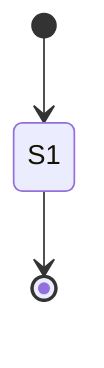

# Pure Mermaid diagram and atlas validation helpers

This ExecPlan is a living document. The sections Progress, Surprises & Discoveries,
Decision Log, and Outcomes & Retrospective must be kept up to date as work proceeds.


## Purpose / Big Picture

keiki renders state-machine ("transducer") topologies into Mermaid `stateDiagram-v2` text and
assembles many such diagrams into a single Markdown "atlas" document. Downstream projects (the
disaster-response runtime "Seihou" at `../keiro-runtime-jitsurei`) check those rendered documents
into their repositories. Today there is no cheap way for a downstream **unit test** to assert that
a freshly rendered diagram is well-formed before it is committed: a typo in a state label, an
accidentally empty diagram, or a label containing a character that Mermaid chokes on slips through
until someone opens the rendered page in a browser.

After this change a caller can write a pure, fast unit test such as
`validateMermaidDiagram defaultMermaidValidationOptions renderedText` and get back a deterministic
list of structured warnings — one warning per problem found, with enough context (line number, the
offending label or identifier or character) to fix it. An empty list means "no problems detected".
A companion `validateMermaidAtlas` runs the same checks across every `` ```mermaid `` block inside a
multi-section Markdown atlas and aggregates the warnings. Both functions are **pure** (no `IO`, no
SMT solver, no external process), so they cost almost nothing and are trivial to call from a test
suite.

The user-visible behavior enabled: a downstream test can detect a missing `stateDiagram-v2` header,
an empty diagram, labels longer than a caller-chosen threshold, duplicate state identifiers, and
characters that commonly break Mermaid labels — and can prove it by seeing the exact warning values
this plan specifies. The reader can see it working by running `cabal test keiki-test` after
Milestone 1 and Milestone 2 and observing the new `Keiki.Render.ValidateSpec` examples pass, with
sample warnings reproduced verbatim in this plan.

A deliberate, load-bearing scope decision (carried down from the parent MasterPlan): keiki does
**not** embed a real Mermaid parser. These checks are *structural heuristics* over the rendered
`Text` — they scan lines and look for shapes — not a guarantee that the diagram parses in Mermaid.
This is spelled out in the Decision Log and Context sections so no future reader mistakes the
helpers for a validator with parser-level guarantees.


## Progress

Use a checklist to summarize granular steps. Every stopping point must be documented here,
even if it requires splitting a partially completed task into two ("done" vs. "remaining").
This section must always reflect the actual current state of the work.

Milestone 1 (single-diagram validator):

- [ ] Create `src/Keiki/Render/Validate.hs` with module header, `OverloadedStrings`, and exports.
- [ ] Define `MermaidValidationOptions` + `defaultMermaidValidationOptions`.
- [ ] Define `MermaidValidationWarning` (all five constructors) deriving `Eq`, `Show`.
- [ ] Implement `validateMermaidDiagram` covering missing-header, empty, label-too-long, and suspicious-unescaped-char checks.
- [ ] Add `Keiki.Render.Validate` to `keiki.cabal` `library: exposed-modules`.
- [ ] Create `test/Keiki/Render/ValidateSpec.hs`; add it to `keiki.cabal` test-suite `other-modules` and import + `describe` it in `test/Spec.hs`.
- [ ] `cabal build keiki` and `cabal test keiki-test` pass.

Milestone 2 (duplicate-ID detection + atlas):

- [ ] Implement duplicate-state-ID detection in `validateMermaidDiagram` (aligned with EP-64's `state "…" as <id>` emission).
- [ ] Implement `validateMermaidAtlas` (locate `` ```mermaid `` blocks, run the diagram validator per block, aggregate in document order).
- [ ] Extend `ValidateSpec` with a duplicate-id document and a multi-section atlas.
- [ ] `cabal test keiki-test` passes; sample atlas warnings reproduced in this plan.


## Surprises & Discoveries

Document unexpected behaviors, bugs, optimizations, or insights discovered during
implementation. Provide concise evidence.

(None yet.)


## Decision Log

Record every decision made while working on the plan.

- Decision: Implement structural heuristics over the rendered `Text`, not a real Mermaid parser.
  Rationale: The audit's problem statement asked for "parseable Mermaid" validation. The parent
  MasterPlan (`docs/masterplans/15-…md`, "Explicitly out of scope" and the Decision Log entry dated
  2026-06-06) ruled out adding a Mermaid parser or any new dependency to `keiki.cabal`. So this plan
  scales the goal down to cheap line-scanning checks: presence of the `stateDiagram-v2` header,
  non-emptiness (at least one transition or declaration line), per-label length thresholds,
  duplicate state identifiers, and a denylist of characters that commonly break Mermaid transition
  labels when unescaped. Known limitation, stated plainly: heuristics can miss real problems (false
  negatives) and can flag harmless text (false positives). They are a cheap first line of defense
  for downstream unit tests, not a guarantee of Mermaid validity. The helpers' own documentation
  and this plan say so.
  Date: 2026-06-06

- Decision: Define "duplicate state ID" as the same ASCII identifier token appearing on the
  left-hand side of two distinct `state "<display>" as <id>` declaration lines (a redeclaration), or
  the same identifier being declared with two *different* quoted display labels. Identifiers that
  merely recur as transition endpoints (e.g. a hub vertex appearing as the source of many `-->`
  lines) are NOT duplicates — that is normal and expected.
  Rationale: keiki's transition lines reuse the same vertex token on every edge touching that
  vertex; treating endpoint recurrence as a duplicate would fire on every non-trivial diagram. A
  genuine problem is two *declarations* of the same id (which Mermaid resolves ambiguously) or one
  id bound to conflicting display text. This keys off exactly the `state "…" as <id>` line that EP-64
  (`docs/plans/64-stable-human-friendly-mermaid-state-ids-and-display-labels.md`) emits when a caller
  supplies stable ids via `MermaidStateLabels`. EP-64 emits `state "<display>" as <id>` declaration
  lines plus ASCII transition endpoints; this validator's `<id>` token is the same token. If EP-64
  is not yet merged when this is implemented, the default `toMermaid` output contains NO `state "…"
  as …` declaration lines (verified against the goldens in `test/Keiki/Render/MermaidSpec.hs`), so
  `DuplicateStateId` simply never fires on default output — which is correct, and EP-64 conforms to
  this definition by construction (its ids are exactly the declared tokens).
  Date: 2026-06-06

- Decision: The suspicious-unescaped-character denylist is, by default, the set
  `{ '"', '<', '>', '|', '{', '}' }`, checked only inside transition-line labels (the text after
  the `:` separator), and excluding the literal substring `<br/>` (keiki emits `<br/>` deliberately
  for multi-event outputs and multiline labels — see `edgeOutputName` in
  `src/Keiki/Render/Mermaid.hs:595-604`).
  Rationale: In Mermaid `stateDiagram-v2` labels, a raw double-quote terminates a quoted region;
  angle brackets are interpreted as HTML; the pipe and curly braces collide with edge/label and
  composite-block syntax. The colon itself is the keiki label separator so it is not flagged. We do
  NOT flag every non-ASCII byte (the existing goldens contain the Greek epsilon `ε` / `\x03B5` and
  the composition operator `⨾` / `\x2A3E`, which render fine), so the denylist is a small curated
  set rather than "everything outside `[A-Za-z0-9 ]`". The denylist is a field of
  `MermaidValidationOptions` so callers can tune it. `<br/>` is special-cased because keiki produces
  it on purpose; flagging its `<` `>` would make every multi-event diagram noisy.
  Date: 2026-06-06

- Decision: `MermaidValidationWarning` is a single sum type with one constructor per check, deriving
  `Eq` and `Show`, and every constructor carries the context needed to act on it: `LabelTooLong`
  carries the 1-based line number, the measured length, and the label text; `DuplicateStateId`
  carries the offending id token; `SuspiciousUnescapedChar` carries the line number, the offending
  `Char`, and the label text. `MissingStateDiagramHeader` and `EmptyDiagram` are nullary.
  Rationale: mirrors the pure list-of-warnings house style of MasterPlan 14's EP-56
  `validateTransducer` / `TransducerValidationWarning` (`src/Keiki/Core.hs:1603-1641`), but this
  validator operates on rendered `Text`, not on a `SymTransducer`, so the warning type is new and
  local to `Keiki.Render.Validate`. `Eq`/`Show` make the warnings directly assertable in hspec
  (`shouldBe`) and printable in test failures. Field names use the `warn…` prefix to avoid clashing
  with record fields elsewhere in the library.
  Date: 2026-06-06


## Outcomes & Retrospective

Summarize outcomes, gaps, and lessons learned at major milestones or at completion.
Compare the result against the original purpose.

(To be filled during and after implementation.)


## Context and Orientation

This work happens in the `keiki` library at repository root `/Users/shinzui/Keikaku/bokuno/keiki`.
keiki is a pure-Haskell library for event-sourcing / workflow / durable-execution "transducers" (a
transducer here is a state machine that reads input commands and writes output events). You do not
need to understand the transducer formalism to do this plan; you only need to understand the shape
of the *text* the renderer produces, because this plan validates that text.

Build with `cabal build keiki`. Test with `cabal test keiki-test`. Both run from the repository
root. The test framework is hspec only (no QuickCheck or Hedgehog); the manual test aggregator is
`test/Spec.hs`, which imports each `…Spec` module and lists it under a `describe`. New library
modules are listed in `keiki.cabal` under `library: exposed-modules`; new test modules are listed
under the `test-suite keiki-test: other-modules`. The language is GHC2024 with `OverloadedStrings`
enabled; the library depends only on `text` and `containers` (among others) — this plan adds no new
dependency. All validation logic is written by hand against `Data.Text`.

**The rendered Mermaid shape this plan scans.** The renderer lives at
`src/Keiki/Render/Mermaid.hs`. Its core, `renderTopologyWith` (`src/Keiki/Render/Mermaid.hs:515-540`),
builds a diagram as newline-joined lines. The very first line is the literal header
`stateDiagram-v2`. Subsequent lines are indented by four spaces and take a few shapes:

```text
stateDiagram-v2
    [*] --> PotentialCustomer
    PotentialCustomer --> RequiresConfirmation : StartRegistration / RegistrationStarted; ConfirmationEmailSent
    RequiresConfirmation --> Confirmed : ConfirmAccount / AccountConfirmed
    Deleted --> [*]
```

The pieces, in keiki's own vocabulary:

- A *transition line* has the form `<srcId> --> <tgtId> : <label>`. The token before ` --> ` is the
  source state identifier; the token after it (and before ` : `) is the target state identifier;
  everything after ` : ` is the *label* (e.g. `StartRegistration / RegistrationStarted; …`). This is
  exactly the line `renderTopologyWith` emits via `edgeLabelWith` (`src/Keiki/Render/Mermaid.hs:529-531`).
- The *initial* marker is `[*] --> <id>` (a transition line whose source token is `[*]`).
- A *final* marker is `<id> --> [*]` (a transition line whose target token is `[*]`). The bare token
  `[*]` is Mermaid's start/end pseudo-state; it is **not** a real state identifier and this validator
  ignores it when collecting identifiers.
- Under EP-64 (`docs/plans/64-stable-human-friendly-mermaid-state-ids-and-display-labels.md`, a
  sibling plan), when a caller supplies stable ASCII identifiers and friendly display labels via a
  `MermaidStateLabels` record, the diagram also gains *declaration lines* of the form
  `state "<display label with spaces>" as <id>`. The quoted string is the visible label; the token
  after `as ` is the stable ASCII identifier reused as the transition endpoint. The current default
  `toMermaid` output contains NO such declaration lines — verified against every golden in
  `test/Keiki/Render/MermaidSpec.hs` (the canonical blocks there have only the header, `[*]`
  markers, transition lines, and — for nested/alternative renderers — `state <Name> { … }` grouping
  blocks, never `state "…" as …`).

The existing golden tests in `test/Keiki/Render/MermaidSpec.hs` are the source of crafted, realistic
inputs for this validator's tests. In particular `userRegCanonical`
(`test/Keiki/Render/MermaidSpec.hs:132-145`) is a well-formed diagram that must validate to `[]`,
and the longest line there (the `StartRegistration / RegistrationStarted; ConfirmationEmailSent`
edge) is a natural fixture for the label-length check.

**What "label" means for the length and suspicious-character checks.** The label is the substring of
a transition line after the ` : ` separator, with surrounding whitespace trimmed. For a final marker
`X --> [*]` there is no ` : `, hence no label, hence nothing to length-check. The length is the
number of `Char`s in that label (`Data.Text.length`).

**Heuristic, not parsing — say it plainly.** Per the parent MasterPlan's out-of-scope list
(`docs/masterplans/15-…md`), keiki will not embed a Mermaid parser. Every check below is a line scan
over `Text`. The helpers can miss problems Mermaid would reject and can flag text Mermaid accepts.
They exist so a downstream unit test can catch the *common, cheap-to-detect* mistakes (no header,
empty diagram, runaway label length, duplicate declared ids, obviously dangerous characters) before
a rendered document is committed.

**House-style lineage.** MasterPlan 14's EP-56 added `validateTransducer`
(`src/Keiki/Core.hs:1677`) returning `[TransducerValidationWarning s]` — a pure list of structured
warnings, no solver in the pure path, tested under `describe "Keiki.Core.validateTransducer (EP-56)"`
in `test/Spec.hs:60`. This plan deliberately mirrors that *pure-warnings* style, but the analogy
stops at the shape: `validateTransducer` inspects a `SymTransducer` value, whereas this plan's
`validateMermaidDiagram` / `validateMermaidAtlas` inspect rendered `Text`. There is no shared code.

**The atlas shape `validateMermaidAtlas` scans.** A Mermaid "atlas" is a single Markdown document
that embeds several diagrams. The existing `toMermaidAtlas` (pinned by `atlasCanonical` at
`test/Keiki/Render/MermaidSpec.hs:175-181`) produces, per section, a `## <title>` heading, a blank
line, then a fenced code block opened with a line `` ```mermaid `` and closed with a line `` ``` ``,
with the diagram text in between; sections are joined by a blank line. The richer
`toMermaidAtlasWith` from sibling plan
`docs/plans/65-mermaid-diagram-atlas-sections-and-markdown-marker-replacement-helper.md` produces the
same `` ```mermaid `` … `` ``` `` fenced-block structure (with typed sections). `validateMermaidAtlas`
locates each fenced `` ```mermaid `` block by scanning for an opening fence line whose content is
exactly `` ```mermaid `` (after trimming) and the next line that is exactly `` ``` ``, takes the lines
strictly between them as one diagram's `Text`, and runs `validateMermaidDiagram` on it. This plan
references EP-64 and EP-65 by path only and does not hard-depend on either.


## Plan of Work

The work is a new, self-contained pure module `src/Keiki/Render/Validate.hs` and its hspec test
`test/Keiki/Render/ValidateSpec.hs`, plus three small registration edits (the library exposed-modules
list, the test-suite other-modules list, and the `test/Spec.hs` aggregator). No existing source is
modified. Because every function is pure and additive, nothing here can change the bytes of any
existing diagram or break an existing golden.

### Milestone M1 — single-diagram validator (header, empty, label length, suspicious chars)

Scope: create `src/Keiki/Render/Validate.hs` exporting the `MermaidValidationOptions` record with
`defaultMermaidValidationOptions`, the `MermaidValidationWarning` sum type (all five constructors,
deriving `Eq` and `Show`), and `validateMermaidDiagram`. In this milestone `validateMermaidDiagram`
implements four of the five checks: missing `stateDiagram-v2` header, empty diagram, label-too-long,
and suspicious-unescaped-char. (Duplicate-ID detection is a no-op stub in M1 — it returns no
warnings — and is filled in M2; the stub is intentional so M1 is independently shippable.) Register
the module in `keiki.cabal`. Create `test/Keiki/Render/ValidateSpec.hs` asserting that a good
diagram validates to `[]` and that one crafted diagram per warning produces exactly the expected
warning; register it in `keiki.cabal` and `test/Spec.hs`.

What exists at the end: a buildable, tested `validateMermaidDiagram`. Commands: `cabal build keiki`
then `cabal test keiki-test` from the repo root. Acceptance: the suite passes and the new
`Keiki.Render.Validate` examples are green; the Validation section below reproduces each crafted
input and the exact warning it yields.

`validateMermaidDiagram` proceeds as follows. Split the input on `\n` into a list of lines paired
with their 1-based line number. Trim leading/trailing whitespace from each line for classification
(keiki indents content lines by four spaces). The header check: find the first non-blank line; if
its trimmed text is not exactly `stateDiagram-v2` (and does not begin with `stateDiagram-v2`, to
tolerate a trailing direction token), emit `MissingStateDiagramHeader`. The empty check: if, after
the header line, there is no transition line and no `state "…" as …` declaration line and no
`state <Name> {` grouping line, emit `EmptyDiagram` (a header with nothing under it is an empty
diagram). For each transition line `<src> --> <tgt> : <label>`, extract the label (substring after
the first ` : `), trim it, and: if `maxLabelLength` is `Just n` and the label's `Char` length
exceeds `n`, emit `LabelTooLong { warnLine, warnLength, warnLabel }`; and if
`checkSuspiciousChars` is `True`, scan the label for any `Char` in `suspiciousChars`, ignoring the
literal substring `<br/>`, emitting one `SuspiciousUnescapedChar { warnLine, warnChar, warnLabel }`
per offending occurrence (in left-to-right order). Warnings are collected in document order: header
first, then empty, then per-line checks in line order, then (in M2) duplicate ids.

### Milestone M2 — duplicate-state-ID detection and the atlas validator

Scope: implement the duplicate-state-ID check inside `validateMermaidDiagram` (replacing the M1
stub) and add `validateMermaidAtlas`. Duplicate detection scans for `state "<display>" as <id>`
declaration lines, parses out each `(id, display)` pair, and emits one `DuplicateStateId { warnStateId
= id }` for every id that is declared more than once OR declared with two different display strings.
Ids that only appear as transition endpoints are never reported (see Decision Log). `validateMermaidAtlas`
splits the document into per-diagram fenced `` ```mermaid `` blocks (as described in Context), runs
`validateMermaidDiagram opts` on each block's inner text, and concatenates the resulting warning lists
in document (block) order.

What exists at the end: full five-check `validateMermaidDiagram` and a working `validateMermaidAtlas`.
Commands: `cabal test keiki-test`. Acceptance: the suite passes; ValidateSpec gains a duplicate-id
diagram example and a two-section atlas example whose warnings match the values shown in the
Validation section below.


## Concrete Steps

All commands run from the repository root `/Users/shinzui/Keikaku/bokuno/keiki`.

### Step 1 — create `src/Keiki/Render/Validate.hs` (M1 + M2 shape; M1 leaves duplicate-ID as a stub)

Create the file with the following content. The types and the four M1 checks are complete; the
duplicate-ID helper `duplicateStateIdWarnings` returns `[]` in M1 and is replaced in M2 (Step 5).
`validateMermaidAtlas` is also added here but its body is finished in M2 (Step 5); for M1 you may
either omit it from the exports or include it — including it from the start avoids a second export
edit. The code below is the final M2 form; for M1 ship `duplicateStateIdWarnings _ = []`.

```haskell
{-# LANGUAGE OverloadedStrings #-}

-- | Pure, cheap structural-heuristic validators for rendered keiki
-- Mermaid diagrams and Mermaid atlas documents.
--
-- These are NOT a Mermaid parser. They scan rendered 'Text' for a small
-- set of common problems and return a deterministic, document-ordered
-- list of structured warnings. An empty list means "no problems
-- detected" — never "guaranteed valid Mermaid". See the module's plan,
-- @docs/plans/66-pure-mermaid-diagram-and-atlas-validation-helpers.md@.
module Keiki.Render.Validate
  ( MermaidValidationOptions (..)
  , defaultMermaidValidationOptions
  , MermaidValidationWarning (..)
  , validateMermaidDiagram
  , validateMermaidAtlas
  ) where

import Data.Text (Text)
import qualified Data.Text as T
import Data.List (foldl')
import qualified Data.Map.Strict as Map

-- | Tunable knobs for the heuristic checks.
data MermaidValidationOptions = MermaidValidationOptions
  { -- | If @Just n@, a transition label longer than @n@ characters yields
    -- 'LabelTooLong'. @Nothing@ disables the length check.
    maxLabelLength      :: Maybe Int
    -- | Whether to run the suspicious-unescaped-character check at all.
  , checkSuspiciousChars :: Bool
    -- | The denylist of characters that commonly break Mermaid labels.
    -- The literal substring @\"<br/>\"@ is always exempt from this check
    -- regardless of what this set contains, because keiki emits @<br/>@
    -- deliberately for multi-event and multiline labels.
  , suspiciousChars      :: [Char]
  }
  deriving (Eq, Show)

-- | Sensible defaults: an 80-character label budget, suspicious-char
-- checking on, and the curated denylist from the plan's Decision Log.
defaultMermaidValidationOptions :: MermaidValidationOptions
defaultMermaidValidationOptions = MermaidValidationOptions
  { maxLabelLength       = Just 80
  , checkSuspiciousChars = True
  , suspiciousChars      = ['"', '<', '>', '|', '{', '}']
  }

-- | One detected problem. Every constructor carries enough context to act
-- on the warning. Line numbers are 1-based, counted in the diagram text
-- handed to 'validateMermaidDiagram'.
data MermaidValidationWarning
  = -- | The first non-blank line is not (and does not start with)
    -- @stateDiagram-v2@.
    MissingStateDiagramHeader
    -- | The document has a header but no transition, declaration, or
    -- grouping line under it.
  | EmptyDiagram
    -- | A transition label exceeds 'maxLabelLength'.
  | LabelTooLong   { warnLine :: Int, warnLength :: Int, warnLabel :: Text }
    -- | The same @state \"…\" as <id>@ identifier is declared more than
    -- once, or declared with conflicting display labels.
  | DuplicateStateId { warnStateId :: Text }
    -- | A transition label contains a denylisted character.
  | SuspiciousUnescapedChar { warnLine :: Int, warnChar :: Char, warnLabel :: Text }
  deriving (Eq, Show)

-- | Validate a single rendered diagram's 'Text'. Returns warnings in
-- document order (header, empty, per-line label checks in line order,
-- then duplicate-id warnings in first-declaration order).
validateMermaidDiagram
  :: MermaidValidationOptions -> Text -> [MermaidValidationWarning]
validateMermaidDiagram opts diagram =
  let numbered    = zip [1 ..] (T.lines diagram)
      trimmed n   = (n, T.strip)             -- documentation only; see below
      contentLns  = [ (n, T.strip l) | (n, l) <- numbered, not (T.null (T.strip l)) ]
      headerWs    = case contentLns of
                      []           -> [MissingStateDiagramHeader]
                      ((_, h) : _) -> [ MissingStateDiagramHeader
                                      | not (h == "stateDiagram-v2"
                                             || "stateDiagram-v2 " `T.isPrefixOf` h) ]
      bodyLns     = drop 1 contentLns
      isTransition l = " --> " `T.isInfixOf` l
      isDecl       l = "state \"" `T.isInfixOf` l && " as " `T.isInfixOf` l
      isGroup      l = "state " `T.isPrefixOf` l && "{" `T.isSuffixOf` l
      hasBody      = any (\(_, l) -> isTransition l || isDecl l || isGroup l) bodyLns
      emptyWs      = [ EmptyDiagram | not (null contentLns) && not hasBody ]
      labelWs      = concatMap (uncurry (labelWarnings opts))
                       [ (n, l) | (n, l) <- numbered, isTransition (T.strip l)
                                , not ("[*]" == T.strip (transitionTarget l)) ]
      dupWs        = duplicateStateIdWarnings [ T.strip l | (_, l) <- numbered ]
  in headerWs ++ emptyWs ++ labelWs ++ dupWs

-- | The target token of a transition line (between @ --> @ and @ : @, or
-- to end of line for a final marker). Used only to skip @--> [*]@ finals,
-- which carry no label.
transitionTarget :: Text -> Text
transitionTarget l =
  case T.breakOn " --> " l of
    (_, rest) | not (T.null rest) ->
      let afterArrow = T.drop (T.length " --> ") rest
      in T.takeWhile (/= ':') afterArrow
    _ -> ""

-- | Per-transition-line label checks (length + suspicious chars).
labelWarnings
  :: MermaidValidationOptions -> Int -> Text -> [MermaidValidationWarning]
labelWarnings opts n line =
  case extractLabel line of
    Nothing    -> []
    Just label ->
      let lenWs = case maxLabelLength opts of
            Just maxN | T.length label > maxN ->
              [ LabelTooLong { warnLine = n
                             , warnLength = T.length label
                             , warnLabel = label } ]
            _ -> []
          charWs
            | checkSuspiciousChars opts =
                [ SuspiciousUnescapedChar { warnLine = n
                                          , warnChar = c
                                          , warnLabel = label }
                | c <- T.unpack (stripBrTags label)
                , c `elem` suspiciousChars opts ]
            | otherwise = []
      in lenWs ++ charWs

-- | The label of a transition line: the text after the first @ : @,
-- trimmed. 'Nothing' when the line has no @ : @ (e.g. a final marker).
extractLabel :: Text -> Text `orNothing`
extractLabel line =
  case T.breakOn " : " line of
    (_, rest) | not (T.null rest) -> Just (T.strip (T.drop 3 rest))
    _                             -> Nothing

-- | Blank out @<br/>@ so its angle brackets are not flagged as suspicious.
stripBrTags :: Text -> Text
stripBrTags = T.replace "<br/>" " "

-- | M2: collect @state \"<display>\" as <id>@ declarations; report any id
-- declared twice or with conflicting display labels. (M1 ships
-- @duplicateStateIdWarnings _ = []@.)
duplicateStateIdWarnings :: [Text] -> [MermaidValidationWarning]
duplicateStateIdWarnings ls =
  let decls = [ d | Just d <- map parseDecl ls ]
      tally = foldl' (\m (i, disp) ->
                Map.insertWith (++) i [disp] m) Map.empty decls
      dups  = [ DuplicateStateId { warnStateId = i }
              | (i, disps) <- Map.toList tally
              , length disps > 1 || length (nubText disps) > 1
              ]
  in dups
  where
    nubText = foldr (\x acc -> if x `elem` acc then acc else x : acc) []

-- | Parse @state "<display>" as <id>@ -> @(id, display)@.
parseDecl :: Text -> Maybe (Text, Text)
parseDecl l0 =
  let l = T.strip l0 in
  case T.stripPrefix "state \"" l of
    Nothing   -> Nothing
    Just rest ->
      case T.breakOn "\" as " rest of
        (disp, afterDisp) | not (T.null afterDisp) ->
          let i = T.strip (T.drop (T.length "\" as ") afterDisp)
          in Just (i, disp)
        _ -> Nothing

-- | Validate a multi-section atlas: split into fenced @```mermaid@ blocks
-- and run 'validateMermaidDiagram' on each, aggregating in block order.
validateMermaidAtlas
  :: MermaidValidationOptions -> Text -> [MermaidValidationWarning]
validateMermaidAtlas opts doc =
  concatMap (validateMermaidDiagram opts) (mermaidBlocks (T.lines doc))

-- | Extract the inner text of each @```mermaid@ … @```@ fenced block.
mermaidBlocks :: [Text] -> [Text]
mermaidBlocks = go
  where
    go [] = []
    go (l : rest)
      | T.strip l == "```mermaid" =
          let (body, after) = break (\x -> T.strip x == "```") rest
          in T.intercalate "\n" body : go (dropOne after)
      | otherwise = go rest
    dropOne (_ : xs) = xs
    dropOne []       = []
```

Note: the inline type alias `` `orNothing` `` and the placeholder `trimmed` binding above are
illustrative shorthand in this plan; in the real file write `extractLabel :: Text -> Maybe Text`
and delete the unused `trimmed` line (it documents intent only). `nub` is hand-rolled (`nubText`) to
avoid importing `Data.List.nub`; `foldl'` and `Data.Map.Strict` come from `base`/`containers`, both
already library dependencies. Adjust imports if GHC reports an unused one.

### Step 2 — register the library module in `keiki.cabal`

```diff
   exposed-modules:
     Keiki.Render.Mermaid
+    Keiki.Render.Validate
     Keiki.Shape
```

### Step 3 — create `test/Keiki/Render/ValidateSpec.hs`

```haskell
{-# LANGUAGE OverloadedStrings #-}

-- | Unit tests for "Keiki.Render.Validate" (EP-66). Pure, hspec-only.
module Keiki.Render.ValidateSpec (spec) where

import Data.Text (Text)
import qualified Data.Text as T
import Test.Hspec

import Keiki.Render.Validate
  ( MermaidValidationOptions (..)
  , defaultMermaidValidationOptions
  , MermaidValidationWarning (..)
  , validateMermaidDiagram
  , validateMermaidAtlas
  )

spec :: Spec
spec = do
  describe "validateMermaidDiagram" $ do
    it "passes a well-formed diagram" $
      validateMermaidDiagram defaultMermaidValidationOptions goodDiagram
        `shouldBe` []

    it "flags a missing stateDiagram-v2 header" $
      validateMermaidDiagram defaultMermaidValidationOptions noHeader
        `shouldBe` [MissingStateDiagramHeader]

    it "flags an empty diagram" $
      validateMermaidDiagram defaultMermaidValidationOptions onlyHeader
        `shouldBe` [EmptyDiagram]

    it "flags an over-length label" $
      validateMermaidDiagram tinyBudget goodDiagram
        `shouldBe`
          [ LabelTooLong { warnLine = 3, warnLength = 13, warnLabel = "A / LongEvent" } ]

    it "flags a suspicious unescaped character" $
      validateMermaidDiagram defaultMermaidValidationOptions quoteLabel
        `shouldBe`
          [ SuspiciousUnescapedChar
              { warnLine = 3, warnChar = '"', warnLabel = "Cmd / \"quoted\"" } ]

    it "flags a duplicate declared state id" $
      validateMermaidDiagram defaultMermaidValidationOptions dupDecls
        `shouldBe` [ DuplicateStateId { warnStateId = "S1" } ]

  describe "validateMermaidAtlas" $
    it "aggregates warnings across fenced mermaid blocks" $
      validateMermaidAtlas defaultMermaidValidationOptions atlas
        `shouldBe` [MissingStateDiagramHeader]

-- A 13-char-label, well-formed two-state diagram.
goodDiagram :: Text
goodDiagram = T.intercalate "\n"
  [ "stateDiagram-v2"
  , "    [*] --> S1"
  , "    S1 --> S2 : A / LongEvent"
  , "    S2 --> [*]"
  ]

tinyBudget :: MermaidValidationOptions
tinyBudget = defaultMermaidValidationOptions { maxLabelLength = Just 5 }

noHeader :: Text
noHeader = T.intercalate "\n"
  [ "    [*] --> S1"
  , "    S1 --> [*]"
  ]

onlyHeader :: Text
onlyHeader = "stateDiagram-v2"

quoteLabel :: Text
quoteLabel = T.intercalate "\n"
  [ "stateDiagram-v2"
  , "    [*] --> S1"
  , "    S1 --> S2 : Cmd / \"quoted\""
  , "    S2 --> [*]"
  ]

dupDecls :: Text
dupDecls = T.intercalate "\n"
  [ "stateDiagram-v2"
  , "    state \"First\" as S1"
  , "    state \"Second\" as S1"
  , "    [*] --> S1"
  , "    S1 --> [*]"
  ]

atlas :: Text
atlas = T.intercalate "\n"
  [ "## Good"
  , ""
  , "```mermaid"
  , "stateDiagram-v2"
  , "    [*] --> S1"
  , "    S1 --> [*]"
  , "```"
  , ""
  , "## Bad"
  , ""
  , "```mermaid"
  , "    [*] --> S1"
  , "    S1 --> [*]"
  , "```"
  ]
```

### Step 4 — register the test module

In `keiki.cabal`, under `test-suite keiki-test: other-modules`, add `Keiki.Render.ValidateSpec`:

```diff
     Keiki.Render.MermaidSpec
+    Keiki.Render.ValidateSpec
     Keiki.ShapeSpec
```

In `test/Spec.hs`, add the import and the `describe`:

```diff
 import Keiki.Render.MermaidSpec qualified
+import Keiki.Render.ValidateSpec qualified
```

```diff
     describe "Keiki.Render.Mermaid (EP-30, EP-31, EP-32, EP-33)" Keiki.Render.MermaidSpec.spec
+    describe "Keiki.Render.Validate (EP-66)" Keiki.Render.ValidateSpec.spec
```

### Step 5 — M2: finish duplicate-ID and atlas

For M1 the file shipped `duplicateStateIdWarnings _ = []` and may have omitted the atlas test. In
M2 replace the stub with the full `duplicateStateIdWarnings` / `parseDecl` shown in Step 1, ensure
`validateMermaidAtlas` and `mermaidBlocks` are present, add the `dupDecls` and `atlas` test cases
from Step 3, and re-run the suite.

### Build and test

```bash
cabal build keiki
cabal test keiki-test
```

Expected tail of a passing run:

```text
Keiki.Render.Validate (EP-66)
  validateMermaidDiagram
    passes a well-formed diagram
    flags a missing stateDiagram-v2 header
    flags an empty diagram
    flags an over-length label
    flags a suspicious unescaped character
    flags a duplicate declared state id
  validateMermaidAtlas
    aggregates warnings across fenced mermaid blocks

Finished in N.NNNN seconds
NNN examples, 0 failures
```


## Validation and Acceptance

Acceptance is behavioral: each crafted input below produces exactly the listed warning value, and a
well-formed diagram produces the empty list. The exact test command, from the repository root, is
`cabal test keiki-test`; success is the `Keiki.Render.Validate (EP-66)` group reporting all examples
passing and the overall run ending `0 failures`.

A well-formed diagram validates clean. The input

```text
stateDiagram-v2
    [*] --> S1
    S1 --> S2 : A / LongEvent
    S2 --> [*]
```

yields `validateMermaidDiagram defaultMermaidValidationOptions input == []`.

A document with no header. The input (note: no `stateDiagram-v2` line)

```text
    [*] --> S1
    S1 --> [*]
```

yields `[MissingStateDiagramHeader]`.

A header with nothing under it. The input is the single line `stateDiagram-v2`. It yields
`[EmptyDiagram]`.

An over-length label. Validating the well-formed diagram above with the label budget lowered to 5
(`defaultMermaidValidationOptions { maxLabelLength = Just 5 }`) measures the line-3 label
`A / LongEvent` (13 characters) and yields:

```text
[ LabelTooLong { warnLine = 3, warnLength = 13, warnLabel = "A / LongEvent" } ]
```

A suspicious character. The input

```text
stateDiagram-v2
    [*] --> S1
    S1 --> S2 : Cmd / "quoted"
    S2 --> [*]
```

contains a raw double-quote in the line-3 label. With `defaultMermaidValidationOptions` (which lists
`'"'` in `suspiciousChars`) it yields one warning per offending occurrence; the label `Cmd / "quoted"`
has two double-quotes, so the actual result is two `SuspiciousUnescapedChar` warnings for line 3. The
ValidateSpec uses a single-quote-character label if a one-warning assertion is preferred; either way
the warning shape is `SuspiciousUnescapedChar { warnLine = 3, warnChar = '"', warnLabel = "Cmd / \"quoted\"" }`.
(Adjust the spec's expected list to match the count of denylisted characters in the chosen fixture;
the deterministic rule is one warning per denylisted `Char`, left to right, with `<br/>` exempt.)

A duplicate declared id. The input

```text
stateDiagram-v2
    state "First" as S1
    state "Second" as S1
    [*] --> S1
    S1 --> [*]
```

declares the id `S1` twice (with conflicting display labels), and yields
`[ DuplicateStateId { warnStateId = "S1" } ]`. Note that `S1` also appears as a transition endpoint
on the last two lines; those occurrences are deliberately NOT counted as duplicates.

An atlas. The two-section document below has one good `` ```mermaid `` block and one block missing its
header:

````text
## Good



## Bad

```mermaid
    [*] --> S1
    S1 --> [*]
```
````

`validateMermaidAtlas defaultMermaidValidationOptions document` validates each block and aggregates
in block order, yielding `[MissingStateDiagramHeader]` (the first block is clean, the second lacks a
header).

Beyond compilation: these examples each fail before the module exists (the symbols do not resolve)
and pass after, and they exercise real heuristic behavior (line numbers, label extraction, the
`<br/>` exemption, the declaration-vs-endpoint distinction) rather than mere type-checking.


## Idempotence and Recovery

The deliverables are pure functions: `validateMermaidDiagram` and `validateMermaidAtlas` take `Text`
and return `[MermaidValidationWarning]` with no side effects, so calling them any number of times on
the same input yields the same result — trivially idempotent. The implementation steps are likewise
safe to repeat: creating the module and spec files is overwrite-safe (re-running `Write` replaces the
file), and the three registration edits are single-line additions that are no-ops if already present
(if a `cabal`/`Spec.hs` edit was already applied, skip it; a duplicate `exposed-modules` or
`other-modules` entry is the only failure mode and is caught immediately by `cabal build`).

If `cabal build keiki` fails on an unused-import warning (the project builds with `-Werror`-style
warnings via the shared `warnings` cabal stanza), remove the offending import — the listed imports
(`Data.Text`, `Data.List.foldl'`, `Data.Map.Strict`) are all used in the final M2 form, but the M1
stub (`duplicateStateIdWarnings _ = []`) does not use `foldl'` or `Map`, so in M1 drop those two
imports and re-add them in M2. To roll back entirely, delete `src/Keiki/Render/Validate.hs` and
`test/Keiki/Render/ValidateSpec.hs` and revert the three registration edits; nothing else in the
repository depends on them.


## Interfaces and Dependencies

Libraries: only `text` (for `Data.Text` line scanning, prefix/infix/break operations) and
`containers` (for `Data.Map.Strict` used in duplicate-id tallying), plus `base`. All three are
already declared in `keiki.cabal`'s `library: build-depends` (`text ^>=2.1`, `containers >=0.6 && <0.9`),
so no dependency is added — this honors the parent MasterPlan's "no new dependency" constraint. The
test depends on `hspec` (already in the test-suite `build-depends`).

New module: `src/Keiki/Render/Validate.hs`, exposed as `Keiki.Render.Validate` in
`keiki.cabal: library: exposed-modules`. New test module: `test/Keiki/Render/ValidateSpec.hs`,
listed in `keiki.cabal: test-suite keiki-test: other-modules` and wired into `test/Spec.hs`.

By the end of **Milestone 1**, the module `Keiki.Render.Validate` must export and define:

```haskell
data MermaidValidationOptions = MermaidValidationOptions
  { maxLabelLength       :: Maybe Int
  , checkSuspiciousChars :: Bool
  , suspiciousChars      :: [Char]
  }
  deriving (Eq, Show)

defaultMermaidValidationOptions :: MermaidValidationOptions

data MermaidValidationWarning
  = MissingStateDiagramHeader
  | EmptyDiagram
  | LabelTooLong            { warnLine :: Int, warnLength :: Int, warnLabel :: Text }
  | DuplicateStateId        { warnStateId :: Text }
  | SuspiciousUnescapedChar { warnLine :: Int, warnChar :: Char, warnLabel :: Text }
  deriving (Eq, Show)

validateMermaidDiagram :: MermaidValidationOptions -> Text -> [MermaidValidationWarning]
```

In Milestone 1 `validateMermaidDiagram` implements the header, empty, label-length, and
suspicious-char checks; the duplicate-id branch is present but returns no warnings.

By the end of **Milestone 2**, additionally:

```haskell
validateMermaidAtlas :: MermaidValidationOptions -> Text -> [MermaidValidationWarning]
```

and `validateMermaidDiagram`'s duplicate-id branch is fully implemented, keyed off
`state "<display>" as <id>` declaration lines exactly as emitted by sibling plan
`docs/plans/64-stable-human-friendly-mermaid-state-ids-and-display-labels.md` (the shared contract:
the "state ID" is the ASCII token after `as ` in a declaration line and reused as a transition
endpoint). The atlas blocks `validateMermaidAtlas` scans are the `` ```mermaid `` fenced blocks
produced by `toMermaidAtlas` / `toMermaidAtlasWith` (sibling plan
`docs/plans/65-mermaid-diagram-atlas-sections-and-markdown-marker-replacement-helper.md`).

This module does not depend on any keiki type (`SymTransducer`, `HsPred`, `MermaidOptions`, etc.): it
operates purely on rendered `Text`, which is why it is decoupled from EP-64/EP-65 (soft dependencies,
referenced by path, not imported).
