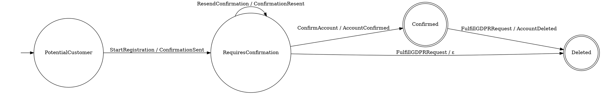

# Future Directions: Design Notes

> **Status: historical.** This was the pre-keiki "what we should build"
> doc, written against the toy `Transducer s c e` / `Decider c e s`
> shapes. Most of the listed directions have shipped under different
> names; the mapping is recorded in
> `architecture-comparison-keiki-vs-crem.md`:
>
> - §1 Profunctor structure → `Keiki.Profunctor` (`SomeSymTransducer`,
>   `lmapCi`, `lmapMaybeCi`, `rmapCo`, `dimapTransducer`, `Profunctor`
>   and `Functor` instances). `Category`, `Strong`, `Choice`, `Arrow`
>   on the wrapper are still planned (MP-9 EP-28/EP-29).
> - §2 Composition → `Keiki.Composition` (`compose`, `alternative`,
>   `feedback1`). `parallel` / `Kleisli` re-deferred (MP-8 EP-24).
> - §3 Weighted transducers → not pursued.
> - §4 Hedgehog generators → not pursued (test suite uses hspec).
> - §5 Visualization → `Keiki.Render.Mermaid` (no DOT renderer).
> - §6 Coalgebraic encoding → not pursued.
>
> Read this note as the prospective sketch that produced the shipped
> surface, not as a roadmap or API reference.

Six capabilities that would make this library production-ready. Each section
covers the mathematical foundation, the DDD interpretation, the Haskell
encoding, and the practical value.

---

## 1. Profunctor Structure

### The Variance Story

Our types have clear variance in their type parameters:

```
Transducer s c e
             ↑ ↑
      contra  covariant
      variant

Acceptor s a
           ↑
       contravariant

Decider c e s
        ↑ ↑
  contra  INVARIANT (both produced and consumed)
  variant
```

The **Transducer** is a profunctor in `(c, e)`: commands appear only as
input to `delta` and `omega` (contravariant), events appear only as output
from `omega` (covariant). The state `s` is invariant — it's both read and
written.

The **Acceptor** is a contravariant functor in its input `a`.

The **Decider** is NOT a profunctor in events. Events appear in both
`exec :: s -> c -> Maybe e` (covariant, output) and
`apply :: s -> e -> Maybe s` (contravariant, input). This is exactly why
tan-event-source needs `dimapE :: (e' -> e) -> (e -> e') -> ...` — a
bijection, not a simple map.

This is a mathematical consequence of the exec/apply decomposition: once you
project a transducer into a decider, you lose profunctorial structure on
events because events now serve double duty.

### Standalone Mapping Functions

```haskell
-- Transducer: profunctor in (c, e)
lmapC :: (c' -> c) -> Transducer s c e -> Transducer s c' e
lmapC f t = t
  { delta = \s -> delta t s . f
  , omega = \s -> omega t s . f
  }

rmapE :: (e -> e') -> Transducer s c e -> Transducer s c e'
rmapE g t = t
  { omega = \s c -> g <$> omega t s c
  }

dimapT :: (c' -> c) -> (e -> e') -> Transducer s c e -> Transducer s c' e'
dimapT f g = rmapE g . lmapC f

-- Acceptor: contravariant in a
contramapA :: (a' -> a) -> Acceptor s a -> Acceptor s a'
contramapA f acc = acc
  { transition = \s -> transition acc s . f
  }

-- Decider: contravariant in c, invariant in e
lmapDeciderC :: (c' -> c) -> Decider c e s -> Decider c' e s
lmapDeciderC f d = d
  { exec = \s -> exec d s . f
  }

dimapDeciderE :: (e' -> e) -> (e -> e') -> Decider c e s -> Decider c e' s
dimapDeciderE from to d = d
  { exec  = \s c -> to <$> exec d s c
  , apply = \s e -> apply d s (from e)
  }

-- GSM: profunctor in (c, e)
lmapGSM :: (c' -> c) -> GSM s c e -> GSM s c' e
rmapGSM :: (e -> e') -> GSM s c e -> GSM s c e'
```

### Typeclass Instances via Newtype

To participate in the Haskell profunctor/category ecosystem, we wrap with
an existential over state:

```haskell
-- Existentially quantified transducer — hides state type
data TransP c e = forall s. TransP (Transducer s c e)

instance Profunctor TransP where
  dimap f g (TransP t) = TransP (dimapT f g t)

instance Functor (TransP c) where
  fmap = rmap

instance Contravariant (flip TransP e) where  -- via Profunctor
  contramap = lmap
```

The existential quantification is important: without it, the `s` parameter
leaks into every Profunctor combinator, making composition unwieldy.

### Filtering (lmapMaybe)

tan-event-source has `lmapMaybeC` — a partial contramap that filters
commands. This is useful for routing a subset of a larger command type to
a specific aggregate:

```haskell
lmapMaybeC :: (c' -> Maybe c) -> Transducer s c e -> Transducer s c' e
lmapMaybeC f t = t
  { delta = \s c' -> f c' >>= delta t s
  , omega = \s c' -> f c' >>= omega t s
  }
```

This gives us `Choice`-like behavior without requiring the full
`ArrowChoice` machinery.

### Value

- **Command routing**: Route a sum type of all commands to specific aggregates
  using `lmapMaybeC`
- **Event versioning**: Transform events between schema versions using `rmapE`
  (or `dimapDeciderE` for deciders)
- **Adapter pattern**: Wrap aggregates to match different bounded context
  interfaces
- **Composition**: Required for Category instance (next section)

---

## 2. Transducer Composition

### Mathematical Foundation

The composition of two transducers feeds the output of the first as input
to the second. Given:

```
T₁ = ⟨S₁, C, E₁, δ₁, ω₁, s₀₁, F₁⟩     -- commands → events₁
T₂ = ⟨S₂, E₁, E₂, δ₂, ω₂, s₀₂, F₂⟩    -- events₁ → events₂
                ↑
        T₂'s input is T₁'s output
```

Their composition is:

```
T₁ ∘ T₂ = ⟨S₁ × S₂, C, E₂, δ, ω, (s₀₁, s₀₂), F₁ × F₂⟩
```

Where:

```
δ((s₁, s₂), c) =
  case (δ₁(s₁, c), ω₁(s₁, c)) of
    (Just s₁', Just e₁)  → (s₁',) <$> δ₂(s₂, e₁)   -- feed event to T₂
    (Just s₁', Nothing)  → Just (s₁', s₂)             -- ε: T₁ silent, T₂ unchanged
    (Nothing, _)         → Nothing                     -- T₁ rejects command

ω((s₁, s₂), c) =
  case ω₁(s₁, c) of
    Just e₁ → ω₂(s₂, e₁)     -- T₂ transforms T₁'s event
    Nothing → Nothing          -- no input for T₂
```

### Haskell Encoding

```haskell
-- | Compose two transducers: feed T₁'s events as commands to T₂.
--
-- This is the formal model of event-driven choreography:
-- one aggregate's events drive another aggregate's behavior.
compose
  :: Transducer s1 c e1
  -> Transducer s2 e1 e2
  -> Transducer (s1, s2) c e2
compose t1 t2 = Transducer
  { delta = \(s1, s2) c ->
      case delta t1 s1 c of
        Nothing  -> Nothing
        Just s1' -> case omega t1 s1 c of
          Nothing -> Just (s1', s2)        -- ε from T₁
          Just e1 -> case delta t2 s2 e1 of
            Nothing  -> Nothing            -- T₂ rejects
            Just s2' -> Just (s1', s2')
  , omega = \(s1, s2) c ->
      case omega t1 s1 c of
        Nothing -> Nothing
        Just e1 -> omega t2 s2 e1
  , initial = (initial t1, initial t2)
  , isFinal = \(s1, s2) -> isFinal t1 s1 && isFinal t2 s2
  }
```

### Category Instance

With the existential wrapper, composition forms a `Category`:

```haskell
data TransCat a b = forall s. TransCat (Transducer s a b)

instance Category TransCat where
  id = TransCat Transducer
    { delta   = \() a -> Just ()
    , omega   = \() a -> Just a
    , initial = ()
    , isFinal = const True
    }

  TransCat t2 . TransCat t1 = TransCat (compose t1 t2)
```

The identity transducer has state `()`, passes every input directly to
output, and is always in a final state. It satisfies:

```
id ∘ T = T ∘ id = T
```

(up to state isomorphism: `((), s) ≅ s`)

### DDD Interpretation

Composition models **event-driven choreography** — one aggregate's events
triggering another aggregate's behavior:

```haskell
-- Registration events drive email verification
registration :: Transducer RegState RegCommand RegEvent
verification :: Transducer VerifState RegEvent VerifEvent

-- Composed: registration commands → verification events
pipeline :: Transducer (RegState, VerifState) RegCommand VerifEvent
pipeline = compose registration verification
```

| DDD Pattern | Composition Form |
|-------------|-----------------|
| Process Manager | T_aggregate ∘ T_policy |
| Saga | T_step1 ∘ T_step2 ∘ ... ∘ T_stepN |
| Event-driven choreography | T_producer ∘ T_consumer |
| Read model projection | T_aggregate ∘ T_projector |
| Anti-corruption layer | T_external ∘ T_adapter |

### Multi-Event Composition

For GSM composition (where T₁ produces `[e]`), each event in the list is
fed to T₂ sequentially. The composed machine processes all of T₁'s events
before accepting the next command:

```haskell
composeGSM
  :: GSM s1 c e1
  -> Transducer s2 e1 e2
  -> GSM (s1, s2) c e2
composeGSM g1 t2 = GSM
  { delta = \(s1, s2) c ->
      case GSM.delta g1 s1 c of
        Nothing  -> Nothing
        Just s1' ->
          let events = GSM.omega g1 s1 c
              -- Thread s2 through all events from T₁
              s2' = foldlM (\s e -> delta t2 s e) s2 events
          in  (s1',) <$> s2'
  , omega = \(s1, s2) c ->
      let events = GSM.omega g1 s1 c
          -- Collect T₂'s outputs for each of T₁'s events
      in  catMaybes [ omega t2 s2' e
                    | (s2', e) <- zip (scanl ...) events ]
  , ...
  }
```

### Value

- **Saga/Process Manager modeling**: Compose aggregates into pipelines with
  formal guarantees about event flow
- **Separation of concerns**: Define aggregates independently, compose later
- **Testing**: Test each transducer in isolation, then test the composition
- **Architecture documentation**: The composition graph IS the system
  architecture

---

## 3. Weighted Transducers

### Mathematical Foundation

A Weighted Finite-State Transducer (WFST) extends the FST with weights from
a semiring. A **semiring** (K, ⊕, ⊗, 0̄, 1̄) has:

- ⊕ (plus): aggregation over paths (associative, commutative, identity 0̄)
- ⊗ (times): combination along a path (associative, identity 1̄)
- 0̄ ⊗ k = k ⊗ 0̄ = 0̄ (annihilation)

Common semirings:

| Semiring | ⊕ | ⊗ | 0̄ | 1̄ | Use |
|----------|---|---|---|---|-----|
| Boolean | ∨ | ∧ | False | True | Unweighted (our current model) |
| Tropical | min | + | ∞ | 0 | Shortest path / lowest cost |
| Log | log(e^a + e^b) | + | -∞ | 0 | Probabilities (log domain) |
| Natural | + | × | 0 | 1 | Counting paths |
| Viterbi | max | × | 0 | 1 | Most likely path |

A WFST is an 8-tuple:

```
T = (S, C, E, δ, ω, s₀, F, K)
```

Where transitions carry weights:

```
δ: S × C → S × K     -- transition + weight
ω: S × C → E × K     -- output + weight (may differ from transition weight)
λ: s₀ → K            -- initial weight
ρ: F → K             -- final weight
```

**Path weight** = ⊗-product of all edge weights along the path.
**Transduction weight** = ⊕-sum over all accepting paths producing the
same output.

### Haskell Encoding

```haskell
-- | A semiring. Laws:
-- (⊕) is associative, commutative, with identity 'zero'
-- (⊗) is associative, with identity 'one'
-- zero ⊗ x = x ⊗ zero = zero (annihilation)
-- (⊗) distributes over (⊕)
class Semiring k where
  zero :: k
  one  :: k
  (⊕)  :: k -> k -> k
  (⊗)  :: k -> k -> k

instance Semiring Bool where
  zero = False; one = True; (⊕) = (||); (⊗) = (&&)

-- | Tropical semiring: shortest path / minimum cost.
newtype Tropical = Tropical { getCost :: Double }
instance Semiring Tropical where
  zero = Tropical (1/0)           -- infinity
  one  = Tropical 0
  Tropical a ⊕ Tropical b = Tropical (min a b)
  Tropical a ⊗ Tropical b = Tropical (a + b)

-- | Natural number semiring: count paths.
newtype Count = Count { getCount :: Natural }
instance Semiring Count where
  zero = Count 0; one = Count 1
  Count a ⊕ Count b = Count (a + b)
  Count a ⊗ Count b = Count (a * b)

-- | Weighted Finite-State Transducer.
data WTransducer s c e k = WTransducer
  { delta        :: s -> c -> Maybe (s, k)      -- transition + weight
  , omega        :: s -> c -> Maybe (e, k)      -- output + weight
  , initial      :: s
  , initialWeight :: k                           -- λ(s₀)
  , isFinal      :: s -> Bool
  , finalWeight  :: s -> k                       -- ρ(s)
  }

-- | Step a weighted transducer. Returns next state, event, and
-- combined transition weight.
wStep
  :: (Semiring k)
  => WTransducer s c e k
  -> s
  -> c
  -> Maybe (s, Maybe e, k)
wStep wt s c = do
  (s', wDelta) <- delta wt s c
  let (me, wOmega) = case omega wt s c of
        Just (e, w) -> (Just e, w)
        Nothing     -> (Nothing, one)
  pure (s', me, wDelta ⊗ wOmega)

-- | Transduce with weights. Returns events, final state, and total
-- path weight (⊗-product of all transition weights).
wTransduce
  :: (Semiring k)
  => WTransducer s c e k
  -> [c]
  -> Maybe ([e], s, k)
```

### Lifting Unweighted to Weighted

Our current unweighted transducer is a WFST over the Boolean semiring:

```haskell
-- | Lift an unweighted transducer to a weighted one over any semiring.
-- All valid transitions get weight 'one', making this equivalent
-- to the original.
liftWeighted :: (Semiring k) => Transducer s c e -> WTransducer s c e k
liftWeighted t = WTransducer
  { delta        = \s c -> (, one) <$> Transducer.delta t s c
  , omega        = \s c -> (, one) <$> Transducer.omega t s c
  , initial      = Transducer.initial t
  , initialWeight = one
  , isFinal      = Transducer.isFinal t
  , finalWeight  = const one
  }
```

### DDD Interpretation

| Use Case | Semiring | Weights Represent |
|----------|----------|-------------------|
| Process mining | Natural | Observed transition frequencies |
| SLA modeling | Tropical | Expected latency of each step |
| Cost estimation | Tropical | Resource cost of operations |
| Risk scoring | Viterbi | Probability of fraud at each step |
| Compliance | Boolean | Unweighted (current model) |

**Example: SLA-aware User Registration**

```haskell
slaRegistration :: WTransducer RegState RegCommand RegEvent Tropical
slaRegistration = WTransducer
  { delta = \s c -> case (s, c) of
      (PotentialCustomer, StartRegistration) ->
        Just (RequiresConfirmation, Tropical 0.5)    -- 0.5s expected
      (RequiresConfirmation, ConfirmAccount) ->
        Just (Confirmed, Tropical 0.1)               -- 0.1s expected
      ...
  , ...
  }

-- Total expected latency of happy path:
-- 0.5 ⊗ 0.1 = Tropical (0.5 + 0.1) = Tropical 0.6 seconds
```

### Weighted Operations

All FSA operations generalize to WFSTs:

```haskell
-- Weighted composition: path weight = w₁ ⊗ w₂
wCompose
  :: (Semiring k)
  => WTransducer s1 c e1 k
  -> WTransducer s2 e1 e2 k
  -> WTransducer (s1, s2) c e2 k

-- Weighted union: accepting weight = w₁ ⊕ w₂
wUnion
  :: (Semiring k)
  => WAcceptor s1 a k
  -> WAcceptor s2 a k
  -> WAcceptor (s1, s2) a k

-- Best path (requires tropical/Viterbi semiring)
bestPath
  :: (Ord k, Semiring k, Enum c, Bounded c, Enum s, Bounded s)
  => WTransducer s c e k
  -> s                        -- target state
  -> Maybe ([c], k)           -- best command sequence + its weight
```

### Value

- **Process mining**: Attach observed frequencies to transitions from
  production data, analyze most common paths
- **Performance budgeting**: Model expected latency per transition, compute
  total SLA for each lifecycle path
- **Cost analysis**: Model resource costs, find cheapest path to a goal state
- **Risk modeling**: Score fraud probability at each decision point
- **Optimization**: Find the "best" path (shortest, cheapest, most likely)
  through the aggregate lifecycle

---

## 4. Hedgehog Generators

### Why Hedgehog

[Hedgehog](https://hackage.haskell.org/package/hedgehog) has two advantages
over QuickCheck that matter for FSA testing:

1. **Integrated shrinking.** Generators and shrinkers are defined together
   — a `Gen` that produces valid command sequences automatically shrinks to
   shorter valid sequences. No separate `Shrink` instance to keep in sync.

2. **Range control.** Hedgehog's `Range` type gives precise control over
   size distribution, which matters when generating sequences of varying
   length through a state machine.

### Generating from the Model

Given a Transducer with `(Enum s, Bounded s, Enum c, Bounded c)`, we can
enumerate all valid transitions and generate test data directly from the
formal model. Because Hedgehog generators carry shrinking automatically,
every generator below produces *minimal* counterexamples on failure.

### Core Generators

```haskell
import Hedgehog
import Hedgehog.Gen qualified as Gen
import Hedgehog.Range qualified as Range

-- | Generate a random valid command sequence by random walk.
--
-- Starting from the initial state, at each step pick a random valid
-- command, apply it, and continue until reaching a final state or
-- a maximum length.
--
-- Shrinking is automatic: Hedgehog will try shorter subsequences
-- and earlier enum values, keeping only those that remain valid
-- walks through the transducer.
genCommands
  :: (Enum c, Bounded c)
  => Transducer s c e
  -> Range Int                  -- length range
  -> Gen [c]
genCommands t range = do
  len <- Gen.int range
  go (initial t) len
  where
    go _ 0 = pure []
    go s n = do
      let valids = [ c | c <- [minBound..maxBound]
                       , isJust (delta t s c) ]
      case valids of
        [] -> pure []               -- stuck: no valid commands
        cs -> do
          c <- Gen.element cs
          let Just s' = delta t s c
          rest <- go s' (n - 1)
          pure (c : rest)

-- | Generate a command sequence that reaches a specific target state.
--
-- Uses BFS to find a path, then returns it as a generator
-- (enabling Hedgehog to shrink toward shorter valid paths).
genCommandsTo
  :: (Eq s, Enum c, Bounded c, Enum s, Bounded s)
  => Transducer s c e
  -> s                          -- target state
  -> Gen [c]
genCommandsTo t target = case bfs (initial t) target of
  Nothing   -> Gen.discard        -- unreachable state
  Just path -> pure path
  where
    bfs start goal = ...          -- BFS over the state graph

-- | Generate a valid (commands, events) trace pair.
genTrace
  :: (Enum c, Bounded c)
  => Transducer s c e
  -> Range Int
  -> Gen ([c], [e])
genTrace t range = do
  cmds <- genCommands t range
  let (events, _) = transduce t cmds
  pure (cmds, events)

-- | Generate a valid event stream (for testing reconstitution).
genEvents
  :: (Enum c, Bounded c)
  => Transducer s c e
  -> Range Int
  -> Gen [e]
genEvents t range = snd <$> genTrace t range

-- | Generate an INVALID command sequence (for testing rejection).
--
-- Produces a valid prefix followed by one invalid command.
-- Shrinking will minimize the prefix while keeping the final
-- command invalid.
genInvalidCommands
  :: (Enum c, Bounded c)
  => Transducer s c e
  -> Range Int
  -> Gen [c]
genInvalidCommands t range = do
  prefix <- genCommands t range
  let (_, s) = transduce t prefix
  let invalids = [ c | c <- [minBound..maxBound]
                     , isNothing (delta t s c) ]
  case invalids of
    [] -> Gen.discard               -- no invalid commands in this state
    cs -> do
      bad <- Gen.element cs
      pure (prefix ++ [bad])
```

### Core Properties

```haskell
-- | Projection consistency: every valid command sequence produces
-- a valid event sequence.
prop_projectionConsistency
  :: (Enum c, Bounded c, Eq s, Eq e, Show c, Show e)
  => Transducer s c e
  -> Acceptor s e               -- output projection
  -> Property
prop_projectionConsistency t eventAcc = property $ do
  cmds <- forAll $ genCommands t (Range.linear 0 20)
  let (events, _) = transduce t cmds
  assert (accepts eventAcc events)

-- | Reconstitution: folding apply over the event stream from a
-- transduction produces the same final state as the transduction.
prop_reconstitution
  :: (Enum c, Bounded c, Eq s, Show c, Show s)
  => Transducer s c e
  -> Decider c e s
  -> Property
prop_reconstitution t d = property $ do
  cmds <- forAll $ genCommands t (Range.linear 0 20)
  let (events, finalState) = transduce t cmds
  reconstitute d events === Just finalState

-- | Event-determinism contract for MultiDecider (Approach 3).
--
-- Exhaustively checks every (state, command) pair — no sampling.
-- With small Enum/Bounded types this is a complete proof.
prop_eventDeterminism
  :: (Enum s, Bounded s, Enum c, Bounded c, Eq s, Show s, Show c)
  => GSM s c e
  -> (s -> e -> Maybe s)        -- apply function under test
  -> Property
prop_eventDeterminism gsm applyFn = withTests 1 $ property $ do
  -- Single test that checks all pairs exhaustively
  let failures =
        [ (s, c, expected, actual)
        | s <- [minBound..maxBound]
        , c <- [minBound..maxBound]
        , Just expected <- [GSM.delta gsm s c]
        , let events = GSM.omega gsm s c
        , let actual = foldlM applyFn s events
        , actual /= Just expected
        ]
  annotate $ "Failing (state, command, expected, actual): " ++ show failures
  assert (null failures)

-- | Exhaustive transition table verification.
-- With Enum/Bounded types this checks EVERY (state, command) pair.
prop_exhaustiveConsistency
  :: (Enum s, Bounded s, Enum c, Bounded c, Eq s, Eq e, Show s, Show c, Show e)
  => Transducer s c e
  -> Decider c e s
  -> Property
prop_exhaustiveConsistency t d = withTests 1 $ property $ do
  let failures =
        [ (s, c, problem)
        | s <- [minBound..maxBound]
        , c <- [minBound..maxBound]
        , problem <- case (delta t s c, exec d s c) of
            (Nothing, Nothing) -> []                    -- both reject: ok
            (Nothing, Just _)  -> ["decider accepts but transducer rejects"]
            (Just _,  Nothing) -> ["transducer accepts but decider rejects"]
            (Just s', Just e)  -> case apply d s e of
              Just s'' | s'' == s' -> []                -- match: ok
              Just s'' -> ["apply gives " ++ show s'' ++ " but delta gives " ++ show s']
              Nothing  -> ["apply rejects event " ++ show e]
        ]
  annotate $ "Failures: " ++ show failures
  assert (null failures)
```

### Integrated Shrinking

Hedgehog's key advantage: shrinking is built into the generator tree.
When `genCommands` produces `[StartRegistration, ResendConfirmation,
ResendConfirmation, ConfirmAccount]` and a property fails, Hedgehog
automatically tries shorter prefixes and simpler commands, reporting the
*minimal* failing sequence.

No separate shrinking function is needed. This is a significant improvement
over QuickCheck, where maintaining shrink consistency with the generator
is error-prone — especially for constrained generators like ours where
shrunk values must remain valid walks through the transducer.

For cases where you want additional shrinking control:

```haskell
-- | Generate commands with explicit shrink filtering.
-- Only shrunk sequences that are still valid walks are kept.
genCommandsShrinkValid
  :: (Enum c, Bounded c, Eq s)
  => Transducer s c e
  -> Range Int
  -> Gen [c]
genCommandsShrinkValid t range =
  Gen.filter (isValidWalk t) (genCommands t range)
  where
    isValidWalk t' cmds =
      let (_, finalS) = transduce t' cmds
      in  length (fst (transduce t' cmds)) == length cmds
          -- all commands were consumed (none rejected)
```

### Stateful Testing

Hedgehog also supports stateful / model-based testing via
`hedgehog` directly (sequential and parallel command generation).
This pairs naturally with our Transducer as the model:

```haskell
-- | The Transducer IS the model for stateful testing.
-- Generate commands that are valid in the current model state,
-- execute them against the real system, and verify the output
-- matches the Transducer's omega function.
--
-- This is a sketch — full implementation would use Hedgehog's
-- state machine testing API or a custom sequential runner.
prop_systemMatchesModel
  :: (Enum c, Bounded c, Eq e, Show c, Show e)
  => Transducer s c e
  -> (s -> c -> IO (Maybe e))   -- system under test
  -> Property
prop_systemMatchesModel t runSystem = property $ do
  cmds <- forAll $ genCommands t (Range.linear 1 15)
  -- Run each command and compare output to model
  let check _ [] = pure ()
      check s (c : cs) = do
        actual <- evalIO (runSystem s c)
        actual === omega t s c
        case delta t s c of
          Just s' -> check s' cs
          Nothing -> pure ()    -- shouldn't happen: genCommands ensures validity
  check (initial t) cmds
```

### Value

- **Eliminates hand-written test fixtures**: Generate all test data from the
  formal model
- **Exhaustive verification**: With small, enumerable types, check every
  possible transition — no property-based sampling needed
- **Automatic minimal counterexamples**: Hedgehog's integrated shrinking
  produces the shortest failing command sequence without any extra work
- **Regression detection**: If the transducer changes, generators
  automatically produce new valid/invalid sequences
- **Contract verification**: Mechanically verify the event-determinism
  contract for MultiDecider (Approach 3)
- **Coverage**: Guarantee that tests exercise every reachable state and
  transition

---

## 5. Visualization

### Motivation

The formal model encodes the complete behavior of an aggregate. Visualization
makes this model accessible to domain experts, reviewers, and documentation.
Given `(Enum, Bounded, Show)` constraints, we can enumerate every valid
transition and render the complete state diagram.

### DOT / Graphviz

```haskell
-- | Generate a Graphviz DOT representation of a Transducer.
toDot
  :: (Enum s, Bounded s, Enum c, Bounded c, Show s, Show c, Show e)
  => Transducer s c e
  -> String
toDot t = unlines $
  [ "digraph Aggregate {"
  , "  rankdir=LR;"
  , "  node [shape=circle];"
  ]
  ++
  -- Mark initial state
  [ "  \"\" [shape=none];"
  , "  \"\" -> " ++ quote (show (initial t)) ++ ";"
  ]
  ++
  -- Mark final states with double circle
  [ "  " ++ quote (show s) ++ " [shape=doublecircle];"
  | s <- [minBound..maxBound]
  , isFinal t s
  ]
  ++
  -- Transitions
  [ "  " ++ quote (show s) ++ " -> " ++ quote (show s')
    ++ " [label=" ++ quote label ++ "];"
  | s <- [minBound..maxBound]
  , c <- [minBound..maxBound]
  , Just s' <- [delta t s c]
  , let event = omega t s c
  , let label = show c ++ " / " ++ maybe "ε" show event
  ]
  ++
  [ "}" ]
  where
    quote s = "\"" ++ s ++ "\""
```

**Example output** for User Registration:



### Mermaid (for Markdown / GitHub)

```haskell
-- | Generate a Mermaid state diagram.
toMermaid
  :: (Enum s, Bounded s, Enum c, Bounded c, Show s, Show c, Show e)
  => Transducer s c e
  -> String
toMermaid t = unlines $
  [ "stateDiagram-v2" ]
  ++
  [ "  [*] --> " ++ show (initial t) ]
  ++
  [ "  " ++ show s ++ " --> [*]"
  | s <- [minBound..maxBound], isFinal t s ]
  ++
  [ "  " ++ show s ++ " --> " ++ show s'
    ++ " : " ++ show c ++ " / " ++ maybe "ε" show event
  | s <- [minBound..maxBound]
  , c <- [minBound..maxBound]
  , Just s' <- [delta t s c]
  , let event = omega t s c
  ]
```

### Acceptor Visualization

Render just the Acceptor (command or event language) to focus on validity
without output clutter:

```haskell
acceptorToDot
  :: (Enum s, Bounded s, Enum a, Bounded a, Show s, Show a)
  => Acceptor s a
  -> String
```

### Diff Visualization

When a Transducer changes (new states, new transitions), show what was
added/removed:

```haskell
-- | Compute the diff between two transducers.
data TransDiff s c e = TransDiff
  { addedTransitions   :: [(s, c, s, Maybe e)]
  , removedTransitions :: [(s, c, s, Maybe e)]
  , addedStates        :: [s]
  , removedStates      :: [s]
  }

diffTransducers
  :: (Enum s, Bounded s, Enum c, Bounded c, Eq s, Eq e)
  => Transducer s c e
  -> Transducer s c e
  -> TransDiff s c e
```

### Integration Points

| Tool | Format | Use |
|------|--------|-----|
| Graphviz (dot, neato) | DOT | High-quality PDFs, PNGs |
| GitHub/GitLab | Mermaid | In-repo documentation |
| Haddock | DOT embedded | API documentation |
| CI pipeline | DOT diff | PR review — "what changed in the aggregate?" |

### Value

- **Domain expert communication**: Show the aggregate model to non-engineers
- **PR review**: Diff diagrams show exactly what behavioral changes a PR
  introduces
- **Documentation**: Auto-generated, always-current state diagrams
- **Debugging**: Visualize the reachable state space to find missing
  transitions
- **Onboarding**: New team members see the aggregate behavior at a glance

---

## 6. Coalgebraic Encoding

### Motivation

Our current Transducer type exposes the state type parameter `s`:

```haskell
data Transducer s c e = Transducer { delta :: s -> c -> Maybe s, ... }
```

This means:
- Consumers can depend on the specific state representation
- Composition leaks state into the type: `Transducer (s1, s2) c e`
- No way to add effects (IO, errors, context) to transitions

The **coalgebraic encoding** — inspired by the `automaton` package — solves
all three by existentially quantifying the state and parameterizing over
an effect monad.

### Mathematical Foundation

A coalgebra for the functor F is a pair (S, step: S → F(S)). For a Mealy
machine, F(S) = (Input → (Output, S)), giving:

```
step: S → Input → (Output, S)
```

The coalgebraic view treats the machine as an *observation* — we can only
interact with it through step, not inspect its state directly. Two machines
with different internal states but identical step behavior are
**bisimilar** — observationally equivalent.

### Haskell Encoding

```haskell
-- | Effectful Transducer with existentially quantified state.
--
-- The state is hidden — consumers interact only through 'estep'.
-- The effect monad 'm' parameterizes what side effects transitions
-- can perform.
data EffTransducer m c e = forall s. EffTransducer
  { eState   :: s
  , eStep    :: s -> c -> m (Maybe (s, Maybe e))
  , eFinal   :: s -> Bool
  }

-- | Pure transducer (no effects). Equivalent to our current Transducer
-- but with hidden state.
type PureTransducer = EffTransducer Identity

-- | Transducer with typed domain errors.
type FallibleTransducer err = EffTransducer (Either err)

-- | Transducer with IO effects (external lookups, side effects).
type IOTransducer = EffTransducer IO

-- | Transducer with read-only context.
type ContextTransducer ctx = EffTransducer (Reader ctx)
```

### Lifting the Current Model

```haskell
-- | Lift our concrete Transducer to the coalgebraic encoding.
toEff :: Transducer s c e -> EffTransducer Identity c e
toEff t = EffTransducer
  { eState = initial t
  , eStep  = \s c -> Identity $ do
      s' <- delta t s c
      pure (s', omega t s c)
  , eFinal = isFinal t
  }

-- | Recover a concrete Transducer (if you know the state type).
-- Only possible before existential quantification.
fromEff :: s -> (s -> c -> Maybe (s, Maybe e)) -> (s -> Bool) -> Transducer s c e
fromEff s0 step final = Transducer
  { delta   = \s c -> fst <$> runIdentity (step s c)  -- won't compile as-is
  , omega   = ...
  , initial = s0
  , isFinal = final
  }
```

### Effectful Transitions

The key advantage: transitions can perform effects.

```haskell
-- | A registration transducer that checks email uniqueness
-- via a database lookup during the StartRegistration transition.
registrationIO :: (EmailRepo m) => EffTransducer m RegCommand RegEvent
registrationIO = EffTransducer
  { eState = PotentialCustomer
  , eStep = \s c -> case (s, c) of
      (PotentialCustomer, StartRegistration email) -> do
        exists <- checkEmailExists email    -- effectful!
        if exists
          then pure Nothing                 -- reject: email taken
          else pure (Just (RequiresConfirmation, Just ConfirmationSent))
      ...
  , eFinal = \case { Confirmed -> True; Deleted -> True; _ -> False }
  }
```

### Effectful Composition

Composition generalizes naturally to effectful transducers:

```haskell
effCompose
  :: (Monad m)
  => EffTransducer m c e1
  -> EffTransducer m e1 e2
  -> EffTransducer m c e2
effCompose (EffTransducer s1 step1 fin1) (EffTransducer s2 step2 fin2) =
  EffTransducer
    { eState = (s1, s2)
    , eStep = \(st1, st2) c -> do
        r1 <- step1 st1 c
        case r1 of
          Nothing -> pure Nothing
          Just (st1', Nothing) -> pure (Just ((st1', st2), Nothing))
          Just (st1', Just e1) -> do
            r2 <- step2 st2 e1
            case r2 of
              Nothing -> pure Nothing
              Just (st2', me2) -> pure (Just ((st1', st2'), me2))
    , eFinal = \(st1, st2) -> fin1 st1 && fin2 st2
    }
```

### Category Instance (Effectful)

```haskell
data EffCat m a b = forall s. EffCat
  { state :: s
  , step  :: s -> a -> m (Maybe (s, Maybe b))
  , final :: s -> Bool
  }

instance (Monad m) => Category (EffCat m) where
  id = EffCat () (\() a -> pure (Just ((), Just a))) (const True)
  (.) = effCompose (flipped)

instance (Monad m) => Profunctor (EffCat m) where
  dimap f g (EffCat s step fin) = EffCat s
    (\st a -> fmap (fmap (fmap g)) (step st (f a)))
    fin
```

### When to Use Each Encoding

| Encoding | State | Effects | Use Case |
|----------|-------|---------|----------|
| `Transducer s c e` | Exposed | None | Definition, testing, visualization |
| `TransCat c e` | Hidden | None | Composition, profunctor combinators |
| `EffTransducer m c e` | Hidden | Monad m | Runtime execution with effects |
| `EffCat m c e` | Hidden | Monad m | Effectful composition pipelines |

The recommended pattern is **define** with concrete `Transducer`, **test**
with the concrete type (generators, visualization, exhaustive checks),
then **lift** to `EffTransducer` for runtime execution.

```haskell
-- 1. Define (concrete, testable)
registration :: Transducer RegState RegCommand RegEvent

-- 2. Test (generators, properties, visualization)
prop_reconstitution = ...
diagram = toDot registration

-- 3. Run (effectful, composed)
registrationRuntime :: EffTransducer IO RegCommand RegEvent
registrationRuntime = toEffWith registration $ \s c -> do
  -- Add effectful validation, logging, metrics, etc.
  ...
```

### Value

- **Encapsulation**: State is hidden; consumers can't depend on internals
- **Effects**: Transitions can perform IO, read config, throw typed errors
- **Composition**: Fused step functions optimize well (GHC can inline)
- **Separation of concerns**: Pure model for testing, effectful wrapper for
  production
- **Runtime flexibility**: Same aggregate definition works with different
  effect stacks (test vs. production)

---

## Implementation Priority

Ordered by value-to-effort ratio:

| Priority | Direction | Effort | Value | Reason |
|----------|-----------|--------|-------|--------|
| 1 | Hedgehog generators | Low | High | Immediate testing payoff; integrated shrinking validates all other work |
| 2 | Profunctor structure | Low | High | Enables command routing, event versioning — core API ergonomics |
| 3 | Composition | Medium | High | Models sagas/choreography — the most important DDD pattern after aggregates |
| 4 | Visualization | Low | Medium | DOT generation is ~30 lines; huge communication value |
| 5 | Coalgebraic encoding | Medium | Medium | Bridge to runtime; can defer until production use |
| 6 | Weighted transducers | High | Niche | Powerful but specialized; add when process mining or SLA modeling is needed |
